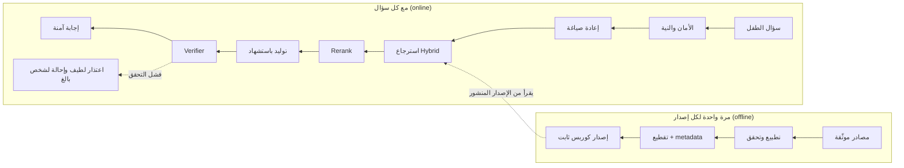

# معمارية رفيق التعلّم الإسلامي — لكل مكوّن

آخر تحديث: 2026-09-27

> **ملاحظة نقل (2026-09-27):** انتقل هذا الملف من جذر المستودع إلى `doc/plan.md`
> ضمن تجهيز تاسكات الكوربس (`doc/corpus-tasks.md`). لا علاقة له بـ
> [`rag-system.md`](rag-system.md)، وهو عقد التنفيذ الحالي الموثّق للنظام
> الموجود فعلاً بـ `src/companion_api/rag/`. هذا الملف هو خطة معمارية جديدة لكل
> مكوّن (بما فيها الكوربس) والبرومبتات المرافقة لها.

## نظرة عامة

نبدأ بالكوربس لأن كل مكوّن بعده يعتمد عليه: استرجاع ضعيف على داتا ممتازة ينصلح، لكن أقوى استرجاع على داتا ملخبطة ما بينصلح. كل مكوّن هون مستقل وله مدخلات ومخرجات واضحة، عشان تطوروه وتبدلوه واحد واحد بدون ما تكسروا الباقي.



الصف العلوي بيشتغل مرة لكل إصدار كوربس، والصفين التحتيين مع كل سؤال. أي مرحلة بتفشل بتنتهي باعتذار لطيف، مش بجواب من ذاكرة الموديل.

| الترتيب | المكوّن | يعتمد على | أول مخرج ملموس |
| --- | --- | --- | --- |
| 1 | مصادر البيانات والكوربس | لا شيء | ملفات JSONL لـ 5 أنبياء و 40 حديث |
| 2 | الإدخال والتقطيع | 1 | إصدار كوربس بـ manifest و checksums |
| 3 | الاسترجاع | 2 | Recall@5 مقاس على مجموعة تقييم |
| 4 | التوليد والتحقق | 3 | إجابات باستشهادات متحقق منها 100% |
| 5 | الأمان والنوايا | مستقل | مصنّف نوايا بدل الـ keywords |
| 6 | المنسّق والـ API | 3–5 | آلة حالات للـ turn + SSE |
| 7 | Flutter و Unity | 6 | ميزانية أداء مقاسة على جهاز رخيص |
| 8 | البيانات والبنية التحتية | بالتوازي | PostgreSQL + pgvector + فهرس BM25 عربي |
| 9 | التقييم | من أول يوم | بوابة CI تمنع أي تراجع |

المبدأ الحاكم لكل الوثيقة: الموديل بيرتّب ويبسّط ويصنّف، لكن ما بيكتب نص آية أو حديث من ذاكرته أبداً. النص المقدّس بيجي دايماً من مصدر رقمي موثّق وبيتحط بالكود.

## المكوّن 1: مصادر البيانات وتجهيز الكوربس

القرار: الكوربس أربع طبقات، وكل فقرة موجّهة للطفل مربوطة بمعرّف مصدر من الطبقة 0. هاد اللي بيخلي كل جملة بتقولها شخصية Robert قابلة للتتبّع لآية أو حديث محدد.

| الطبقة | المحتوى | مين بيكتبه | يتغيّر؟ |
| --- | --- | --- | --- |
| 0. النص المرجعي | نص القرآن، متن الحديث مع التخريج والحكم | مصدر رقمي موثّق فقط | أبداً، حرفياً |
| 1. الشرح العلمي | تفسير وشرح حديث معتمد | كتب معتمدة من اللجنة | لا |
| 2. محتوى الطفل | مشاهد القصص، شرح الحديث المبسّط، العبرة، الأسئلة | موديل يكتب مسودة + مراجع بشري | مع كل إصدار مراجَع |
| 3. مساعدة التطبيق | كيف أستخدم التطبيق | الفريق | بحرية |

### المصادر المقترحة (تحتاج موافقة اللجنة وفحص الترخيص)

- **القرآن:** النص العثماني من Tanzil أو مصحف مجمّع الملك فهد الرقمي. الترخيص عادةً بيسمح بالاستخدام مع النسبة وبدون تعديل، فتحققوا من الشروط.
- **التفسير:** التفسير الميسّر وتفسير السعدي أنسب لغةً للمستوى المبسّط. ابن كثير كمرجع أعمق للمراجعين.
- **الحديث:** البخاري ومسلم أولاً، ثم ما صحّحه العلماء من الأربعين النووية ورياض الصالحين والأدب المفرد. التحقق من المتن والحكم عبر الدرر السنية أو sunnah.com.
- **قصص الأنبياء:** تُبنى من آيات القرآن والأحاديث الصحيحة فقط. كتاب قصص الأنبياء لابن كثير فيه إسرائيليات وروايات ضعيفة، فبيُستخدم كمرجع ترتيب بس وكل تفصيلة منه بتتعلّم حتى تتحقق.

### النطاق المقترح

- الموجة 1 (للمسابقة): 5 أنبياء بمشاهد كاملة (آدم، نوح، إبراهيم، يوسف، موسى عليهم السلام) + 40 حديث أساسي. جودة عالية ومراجعة كاملة أهم من الحجم.
- الموجة 2: الـ 25 نبياً المذكورين بالقرآن + 150 إلى 300 حديث موزّعة على محاور (الأخلاق، العبادات الأساسية، الآداب، الأسرة، الرحمة بالحيوان).

### مسار تجهيز الداتا

1. جلب النص المرجعي (الطبقة 0) بسكربت من المصدر، مع checksum ورقم الطبعة.
2. الموديل يبني مسودة الطبقة 2 بالبرومبت بآخر الوثيقة: مراجع بالمعرّفات فقط، بدون نسخ النص.
3. سكربت تحقق آلي: كل معرّف آية موجود، كل حديث له حكم وتخريج، ما في فقرة بدون مصدر.
4. المراجع الشرعي يراجع المسودة ويغيّر حالتها من `draft` لـ `approved` أو `rejected`.
5. المقبول فقط يدخل الإصدار الجاي.

ملاحظة مهمة للمسابقة: حتى لو الوقت ضيق، المرحلة 4 ما بتتشال. حديث واحد مغلوط بالعرض أمام الحكام ممكن يخسّركم المسابقة كلها.

## المكوّن 2: الإدخال والتقطيع والـ embeddings

القرار: التقطيع حسب الوحدة الدينية مش حسب عدد الـ tokens، مع نمط small-to-big: نبحث بقطع صغيرة دقيقة، ونعطي الموديل السياق الأكبر اللي بتنتمي إله.

### قواعد التقطيع لكل نوع

| النوع | القطعة الصغيرة (للبحث) | الأصل (للسياق) | ممنوع |
| --- | --- | --- | --- |
| آيات | مقطع موضوعي 1–8 آيات | المقطع + تفسيره | تقسيم آية واحدة |
| تفسير | شرح المقطع نفسه | المقطع القرآني | فصل الشرح عن آيته |
| حديث قصير | الحديث كامل | الحديث + شرحه وعبرته | حذف الحكم أو التخريج |
| حديث طويل (مثل حديث جبريل) | كل سؤال وجوابه | الحديث كامل | إرجاع جزء بدون إشارة لأصله |
| مشهد قصة | 150–300 كلمة، حدث واحد | الفصل (3–5 مشاهد) | مشهد بدون مصدر |
| مساعدة التطبيق | سؤال وجواب | الصفحة | خلطها بمحتوى ديني |

### تقنيات بترفع دقة الاسترجاع

- **رأس سياقي لكل قطعة (Contextual chunk header):** سطر ببداية كل قطعة قبل الـ embedding، مثل "قصة يوسف عليه السلام — المشهد 3: إخوته يلقونه في البئر". مشهد بيبدأ بـ "ثم ذهبوا..." بدون هاد السطر ما بينلقى.
- **أسئلة افتراضية لكل قطعة:** 3–5 أسئلة بألفاظ طفل (فصحى وعامية)، مثل "ليش إخوان يوسف زعلوا منه؟". بنعمل لهم embedding منفصل وكل واحد بيشاور على قطعته. هاد بيسكّر الفجوة بين لغة الطفل ولغة النص.
- **قاموس أسماء وألقاب (alias gazetteer):** يونس = ذو النون = صاحب الحوت، موسى = كليم الله، إبراهيم = خليل الله. جدول حتمي مراجَع بيغذّي الفلترة وإعادة الصياغة.
- **تجميع الحديث المكرّر:** نفس الحديث بالبخاري ومسلم ورياض الصالحين = سجل واحد بـ `cluster_id` ومصدر رئيسي (الأقوى)، عشان ما تطلع ثلاث نتائج متشابهة وتضيّع الـ top-5.

### تطبيع العربي (للفهرس فقط، النص الأصلي ما بيتغيّر)

إزالة التشكيل والتطويل، توحيد أ إ آ إلى ا، وى إلى ي، وة إلى ه، ومعالجة الرسم العثماني (مثل الصلوة → الصلاة) بجدول مقابلة. للـ BM25 استخدموا تجذير خفيف (light stemming) من CAMeL Tools أو Farasa، وقارنوه بدون تجذير على مجموعة التقييم.

### الـ Embeddings

مرشّحين للمقارنة: BGE-M3 (بيدعم العربي وبيطلّع dense و sparse مع بعض)، و Qwen3-Embedding، و multilingual-e5-large. القرار بينحسم بالأرقام على مجموعة التقييم تبعتكم (المكوّن 9)، مش بالسمعة. كل إصدار بيسجّل اسم الموديل ونسخته، وتغيير الموديل = إصدار كوربس جديد.

### الـ Metadata الإلزامية لكل قطعة

`chunk_id`، `parent_id`، `tier`، `content_type`، `source_refs` (مثل `quran:12:4-6` أو `bukhari:6018`)، `grading`، `prophet_id`، `topics`، `age_band`، `language`، `madhhab_scope` (مشترك أو مختلف فيه)، `review_status`، `reviewer`، `release_id`، `checksum`.

الإصدار النهائي ملف manifest فيه كل الـ checksums، وما بيتعدّل بعد النشر. أي تعديل = إصدار جديد، والرجوع للسابق خطوة وحدة.

## المكوّن 3: الاسترجاع

القرار: ست مراحل متتالية، وكل وحدة بتنقاس لحالها. الطفل بيكتب بالعامية وبأخطاء إملائية، والكوربس فصحى، فأكبر مكسب بيجي من جسر هالفجوة قبل البحث.

1. **إعادة صياغة السؤال (Query rewriting)** — استدعاء واحد لموديل صغير سريع بيرجّع JSON فيه:
    - `standalone`: سؤال مستقل بيحل الضمائر من آخر 3 أدوار ("وليش عمل هيك؟" ← "لماذا ألقى إخوة يوسف أخاهم في البئر؟").
    - `msa`: صياغة فصحى مصحّحة إملائياً.
    - `variants`: صياغتين إلى ثلاث مختلفة (multi-query).
    - `entities`: النبي، الموضوع، السورة، اسم الحديث، مطابقة مع قاموس الألقاب.
    - `question_type`: حدث بقصة، سبب، عبرة، معنى حديث، سؤال حكم شرعي (هاد الأخير بيروح للإحالة مباشرة).
2. **فلترة بالـ metadata** — إذا اكتُشف نبي بثقة عالية، البحث بيتحدد بـ `prophet_id` تبعه. دايماً فلترة بالإصدار المنشور والعمر واللغة. هاد لوحده بيمنع أغلب خلط القصص.
3. **بحث Hybrid** — BM25 عربي + بحث vector، لكل صياغة من الصياغات، ودمج النتائج بـ Reciprocal Rank Fusion (القيمة الشائعة k = 60). الـ BM25 بيلقط الأسماء والألفاظ الدقيقة، والـ vector بيلقط المعنى.
4. **Rerank** — cross-encoder متعدد اللغات (مثل bge-reranker-v2-m3) على أعلى 30 نتيجة، وناخد أعلى 5. بيتقارن بالسؤال الفصيح `msa` مش بالعامي.
5. **فحص الكفاية (Sufficiency gate)** — إذا أعلى درجة rerank تحت العتبة، نعتذر قبل التوليد. العتبة بتتضبط على مجموعة التقييم (أسئلة جوابها موجود مقابل أسئلة جوابها مش موجود).
6. **تجميع السياق** — توسيع كل قطعة لأصلها (small-to-big)، حذف المكرّر، ترتيب حسب الطبقة (النص المرجعي أولاً)، وسقف tokens ثابت.

تقنية HyDE (توليد جواب افتراضي للبحث فيه) ممكن ترفع الدقة، بس جربوها كمفتاح بحث فقط: الجواب الافتراضي بينرمى وما بيوصل للموديل أو للطفل. فعّلوها فقط إذا حسّنت Recall@5 بشكل ملحوظ.

| المرحلة | المقياس | ميزانية وقت مقترحة |
| --- | --- | --- |
| إعادة الصياغة | دقة استخراج الكيانات | أقل من 0.8 ثانية |
| Hybrid | Recall@30 | أقل من 0.2 ثانية |
| Rerank | Recall@5 و MRR | أقل من 0.4 ثانية |
| فحص الكفاية | دقة قرار الاعتذار | لحظي |

الأرقام هاي بداية للنقاش، مش مقاسة. خزّنوا نتائج إعادة الصياغة بـ cache لأن أسئلة الأطفال بتتكرّر كثير.

## المكوّن 4: التوليد والتحقق

القرار: الموديل ما بيكتب نص آية أو حديث أبداً، بيكتب معرّفه بس، والسيرفر بيحط النص المرجعي مكانه (Quote-by-reference). هيك استحالة تطلع آية مغلوطة حرفياً، وهاد أقوى نقطة تميّز ممكن تعرضوها.

### شكل المخرج (Structured output)

```json
{
  "answer_type": "grounded",
  "segments": [
    {"text": "كان يوسف عليه السلام صغيراً حين رأى رؤيا عجيبة.", "cites": ["story-yusuf-s01"]},
    {"quote_ref": "quran:12:4", "cites": ["quran-12-004-006"]},
    {"text": "فأخبر أباه يعقوب بما رأى.", "cites": ["story-yusuf-s01"]}
  ],
  "avatar_cue": "curious"
}
```

### المتحقّق (Verifier) — خمس فحوصات بالترتيب

1. **المعرّفات:** كل `cites` و `quote_ref` موجود بالقطع المسترجَعة لهالدور بالذات. حتمي، بدون موديل.
2. **النص العربي المقتبَس:** أي عبارة بين علامات اقتباس بالـ `text` لازم تطابق النص المرجعي بعد التطبيع، وإلا بتنرفض. هاد بيمسك الموديل لما يحاول يقتبس من ذاكرته.
3. **الدعم (Entailment):** كل جملة مدعومة بالقطعة اللي استشهدت فيها. موديل حكم مستقل بيجاوب "مدعوم / غير مدعوم / متناقض" لكل جملة.
4. **سياسة دينية:** ما في صيغة فتوى ("حرام عليك"، "لازم تعمل")، ما في ترجيح مذهبي بدون إذن، ما في وصف جسدي للأنبياء أو الملائكة مش بالمصدر.
5. **ملاءمة العمر:** طول الجملة ومستوى المفردات حسب `age_band`، وما في تفاصيل عنف مخيفة.

إذا فشل فحص: إعادة توليد وحدة مع سبب الفشل، وإذا فشل مرة ثانية بنعتذر. ما في محاولة ثالثة، لأنها بتضيّع وقت الطفل.

### الموديلات

افصلوا بين ثلاث أدوار: موديل صغير وسريع لإعادة الصياغة، موديل التوليد (Qwen الحالي)، وموديل حكم للتحقق. الحكم ممكن يكون نفس الموديل ببرومبت مختلف بالبداية. كلهم من خلال LiteLLM، بما فيهم Qwen المستضاف ذاتياً، عشان التبديل يكون سطر config.

## المكوّن 5: بوابة الأمان وموجّه النوايا

القرار: نستبدل كاشف الـ keywords الحالي بثلاث طبقات، والقاعدة: إذا أي طبقة قالت "ديني" أو "خطر"، السؤال بيروح للمسار المحمي. هون بنفضّل recall على precision لأن خطأ الاتجاه الثاني أسوأ بكتير.

1. **قواعد حتمية:** regex للبيانات الشخصية (أرقام جوال، إيميلات، عناوين، أسماء مدارس)، قائمة كلمات دينية موسّعة بالعامية، وأنماط prompt injection.
2. **مصنّف نوايا صغير:** موديل عربي مدرّب (fine-tuned) على ألفين إلى خمسة آلاف مثال موسوم. الأمثلة بتتولّد بموديل كبير باللهجات الخليجية والشامية والمصرية وبأخطاء إملائية، وبتتراجع بشرياً.
3. **حكم LLM للحالات الغامضة فقط:** لما ثقة المصنّف متوسطة.

| النية | المسار |
| --- | --- |
| سؤال عن قصة نبي أو حديث أو آية | RAG المؤسّس فقط |
| طلب حكم شرعي ("حرام؟"، "يجوز؟") | إحالة لطيفة للوالدين أو المعلّم، مع محتوى مراجَع إذا وُجد |
| تنقّل بالدروس أو مساعدة التطبيق | رد حتمي أو RAG مساعدة |
| دردشة عادية | persona بفحوصاته (ADR 0004) |
| ضيق، إساءة، إيذاء النفس | رد حتمي مراجَع من مسؤول الحماية، بدون موديل |
| بيانات شخصية | تنبيه لطيف + حذف البيانات قبل أي تخزين |
| prompt injection أو خارج النطاق | رد لطيف وتوجيه للدروس |

أرقام خطوط المساندة ونصوص الردود الحساسة بيحطها مسؤول الحماية ويتحقق منها للبلد المستهدف، والموديل ما بيولّدها أبداً. ومخرج الدردشة العادية بيمر من نفس المصنّف كمان، إذا طلع فيه محتوى ديني بينرمى.

## المكوّن 6: منسّق المحادثة والـ API

القرار: كل turn هو آلة حالات (state machine) مخزّنة، وكل انتقال بينكتب كـ event. هيك الـ retry والـ SSE والـ audit كلهم بيطلعوا من نفس المصدر.

```text
received → safety_in → routed → rewriting → retrieving → generating
        → verifying → safety_out → released
أي مرحلة → abstained | redirected | safety | unavailable
```

- ذاكرة المحادثة: آخر 3 أدوار فقط، واستخدامها الوحيد إعادة صياغة السؤال. ما في ذاكرة طويلة بالـ MVP.
- البث: استبدال الـ polling كل ثانية بـ SSE على `GET /v1/turns/{id}/events`، وكل جملة بتنبعت بس بعد التحقق منها. الهدف: أول جملة آمنة بأقل من 4 ثواني (رقم مقترح للقياس).
- كل كتابة بـ idempotency key، والـ retry بيكمل نفس الـ turn.

### Endpoints ناقصة بالوثيقة الأصلية

| Endpoint | الغرض |
| --- | --- |
| `GET /v1/lessons`، `GET /v1/lessons/{id}` | الدروس |
| `GET /v1/stories`، `GET /v1/stories/{id}/scenes` | قصص الأنبياء مشهد مشهد |
| `GET /v1/sources/{ref}` | بطاقة المصدر (نص الآية أو الحديث مع الحكم) |
| `POST /v1/profiles/{id}/progress-events` | التقدّم بالدروس |
| `POST /v1/consents`، `DELETE /v1/consents/{id}` | موافقة ولي الأمر وسحبها |
| `POST /v1/auth/step-up` | رمز ولي الأمر |
| `DELETE /v1/profiles/{id}`، `POST /v1/profiles/{id}/export` | حذف وتصدير بيانات الطفل |

## المكوّن 7: Flutter و Unity

القرار: Flutter بيملك كل شي، و Unity مجرّد شاشة عرض بتستقبل cues. التطبيق لازم يشتغل كامل بالصورة الثابتة لو Unity فشل.

- **ميزانية أداء لازم تتحدّد وتتقاس على جهاز Android رخيص معيّن:** startup، الذاكرة، FPS، حجم الـ APK، نسبة الـ crash. الأرقام نفسها قرار مفتوح بالقسم 18 من الوثيقة الأصلية.
- **بطاقة المصدر في المحادثة:** لما الطفل يضغط "من مكتبة Robert" بتطلع الآية بالرسم العثماني أو الحديث مع حكمه. هاد بيخلّي الثقة ملموسة للأهل وللحكام.
- **الجسر:** JSON envelopes بـ `schemaVersion` كما بالقسم 4.3 من الوثيقة الأصلية، و Unity ما بيستقبل نص الرد أبداً.
- **القصص:** شاشة مشاهد بالتسلسل من `/v1/stories/{id}/scenes`، وبآخر كل مشهد سؤال فهم من الكوربس نفسه. هيك الداتا الوحدة بتغذّي المحادثة والدروس والتحديات.

ملاحظة شرعية لازم تتحسم مع اللجنة بدري: المشاهد والرسومات ما بتصوّر الأنبياء عليهم السلام ولا الصحابة ولا الملائكة، و Robert بيظل راوياً مش شخصية بالقصة.

## المكوّن 8: البيانات والبنية التحتية

القرار: PostgreSQL واحد فيه كل شي، وما في خدمة بحث منفصلة إلا إذا البحث العربي فيه طلع ضعيف بالقياس.

| الحاجة | الاختيار | البديل إذا فشل |
| --- | --- | --- |
| Vectors | pgvector بفهرس HNSW | Qdrant |
| BM25 عربي | فهرس نصي داخل Postgres (كامتداد BM25 أو full-text مع عمود مطبّع مسبقاً) | OpenSearch بمحلّل عربي |
| Cache و rate limits | Redis | — |
| الملفات الأصلية والإصدارات | تخزين كائنات مشفّر | — |
| استضافة Qwen | GPU واحد بـ vLLM ورا LiteLLM | مزوّد API بعد مراجعة الخصوصية |

- جداول الكوربس (`source`، `chunk`، `chunk_question`، `alias`، `corpus_release`) معزولة عن جداول الأطفال. كلام الطفل ما بيدخل الـ vector DB أبداً.
- إذا السوق السعودية: نظام حماية البيانات الشخصية (PDPL) بيأثّر على مكان الاستضافة والموافقات. استضافة محلية غالباً أسهل، بس القرار للمستشار القانوني.
- تحويل الإصدارات من ملفات بالذاكرة لـ Postgres بيصير لما يزيد الكوربس عن بضع آلاف قطعة، وبنفس الـ manifest.

## المكوّن 9: التقييم والمراقبة

القرار: مجموعة تقييم ذهبية (golden set) من 300 إلى 500 سؤال تتبنى بالتوازي مع الكوربس، وأي تغيير بينزل بس إذا ما نزّل أي رقم. بدون هاد، كل تحسين بالمكوّنات 2 و 3 و 4 تخمين.

### توزيع الأسئلة

- أسئلة جوابها بالكوربس، بالفصحى وبأكثر من لهجة وبأخطاء إملائية، مع معرّف القطعة الصحيحة.
- أسئلة دينية جوابها مش بالكوربس (المطلوب: اعتذار).
- أسئلة فخّ بتخلط بين نبيين (مثل سؤال عن الحوت مع ذكر موسى).
- طلبات فتوى، محاولات prompt injection، طلب حديث موضوع مشهور، إفصاح عن ضيق.

### المقاييس والأهداف المقترحة

| المقياس | الهدف |
| --- | --- |
| صحة الاستشهاد (المعرّف موجود ومسترجَع) | 100% |
| تطابق نص الآيات والأحاديث المعروضة | 100% |
| Recall@5 | 90% فأكثر |
| Faithfulness (الجمل المدعومة) | 95% فأكثر |
| دقة الاعتذار عن أسئلة خارج الكوربس | 95% فأكثر |
| أسئلة دينية تسرّبت للدردشة العادية | 0 |
| مسار الأمان الصحيح لإفصاحات الضيق | 100% |

الأهداف مقترحة وبتتعدّل بعد أول قياس. خمسة بالمية من الإجابات كل أسبوع بتروح لمراجع شرعي ويقيّمها، لأن الحكم الآلي بيغلط كمان.

## استراتيجية الفوز بالمسابقة

الفكرة: أغلب الفرق رح تعرض chatbot بيجاوب بطلاقة، إنتو بتعرضوا نظام بيعرف متى ما يجاوب، وبتثبتوا هاد بالأرقام. الثقة هي المنتج، مش الطلاقة.

سيناريو العرض المباشر (بتسلسل ثابت ومجرّب):

1. طفل بيسأل بالعامية وبغلط إملائي عن قصة يوسف ← جواب بسيط مع بطاقة الآية بالرسم العثماني.
2. سؤال متابعة بضمير ("وليش عملوا هيك؟") ← يبيّن إعادة الصياغة.
3. سؤال عن حديث ← المتن مع التخريج والحكم.
4. طلب "احكيلي حديث" موضوع منتشر ← Robert بيقول إنه ما لقاه بمكتبته الموثّقة.
5. طلب فتوى ← إحالة لطيفة للأهل أو المعلّم.
6. محاولة prompt injection ← رفض هادئ.
7. شاشة الأرقام من المكوّن 9: استشهاد 100%، Recall، اعتذار، صفر تسرّب.

- **تزكية شرعية:** خطاب من شيخ أو جهة علمية راجعت عيّنة من الكوربس. هاد غالباً أقوى شي بتقدروا تحطوه بالعرض.
- **العرض ما بيعتمد على الإنترنت:** السيرفر والموديل على جهاز محلي أو فيديو احتياطي جاهز.
- **اقرؤوا معايير التحكيم بدقة** ووزّعوا وقت العرض عليها حسب الأوزان. إذا الابتكار أو الأثر وزنه كبير، قدّموهم قبل التفاصيل التقنية.

## البرومبتات الجاهزة لتجهيز الداتا

القرار: برومبتين منفصلين، وواحد منهم على مرحلتين. الموديل بيبني المشاهد والشرح والأسئلة، لكن نص الآيات والأحاديث بيجي منكم من مصدر موثّق. لو طلبتوا من أي موديل يكتب الأحاديث من ذاكرته، بيغلط بالأرقام وبالألفاظ أحياناً، وهاد بالذات اللي ما بينغتفر بمشروع ديني.

طريقة التشغيل:

1. شغّلوا البرومبت 1 مرة لكل نبي، بمحادثة جديدة كل مرة، واستبدلوا `{اسم_النبي}` و `{slug}`.
2. شغّلوا المرحلة أ من البرومبت 2 لترشيح الأحاديث، ثم جيبوا المتن الموثّق من الدرر السنية أو sunnah.com، وشغّلوا المرحلة ب عليه.
3. كل مخرج بيمر على سكربت تحقق آلي (المراجع موجودة، الـ JSON سليم، ما في مشهد بدون مصدر)، وبعدين على المراجع الشرعي.

### البرومبت 1: قصص الأنبياء

```text
أنت محرر محتوى تعليمي إسلامي للأطفال من عمر 7 إلى 11 سنة، ضمن مشروع يمر كل محتواه على لجنة شرعية قبل النشر. مهمتك تجهيز مسوّدة كوربس لقصة {اسم_النبي} عليه السلام بصيغة JSONL، تُدخَل مباشرة في نظام استرجاع (RAG). الجودة والدقة أهم من الطول، لكن نريد القصة كاملة بكل مراحلها الثابتة.

## قواعد المصادر (غير قابلة للتفاوض)
1. المصادر المسموحة فقط: آيات القرآن الكريم، والأحاديث الصحيحة والحسنة، وما اتفق عليه المفسرون المعتمدون في بيان المعنى.
2. لا تكتب نص أي آية أو حديث أبداً. اكتب المرجع فقط بهذه الصيغة: quran:رقم_السورة:من-إلى (مثال quran:12:4-6)، أو اسم_المصدر:الرقم (مثال bukhari:1234). النظام يضيف النص الحرفي من مصدر موثّق.
3. ممنوع: الإسرائيليات، والروايات الضعيفة، وأي تفصيلة غير ثابتة (أسماء وأعمار وأعداد وأماكن ومدد زمنية). إذا كانت التفصيلة مشهورة عند الناس لكنها غير ثابتة، لا تضعها في المشاهد، واذكرها في excluded_details مع السبب.
4. إذا لم تكن متأكداً من رقم حديث أو من صحته أو من أرقام الآيات، ضع "verification": "needs_check" واكتب وصفاً مختصراً للموضع بدل الرقم. لا تخمّن رقماً أبداً: الرقم الخاطئ أسوأ من الرقم الناقص.
5. لا وصف جسدياً للأنبياء أو الملائكة. لا حوار مخترع على لسان نبي أو ملك. ما نُسب إليهم من كلام يكون فقط ما في الآية أو الحديث، معاداً بمعناه وبصيغة توضح أنه معنى لا نص (مثل: "فقال لأبيه ما معناه...").
6. إذا وُجد خلاف معتبر بين المفسرين في تفصيلة، اذكر القدر المتفق عليه فقط في نص المشهد، وضع "disputed": true واشرح الخلاف في reviewer_notes.

## التقسيم
- قسّم القصة إلى فصول (chapters) بحسب المراحل الكبرى لحياة النبي ودعوته، وكل فصل إلى 3–6 مشاهد (scenes).
- المشهد = حدث واحد متكامل. طوله 150–300 كلمة في نسخة 9–11 سنة، و80–150 كلمة في نسخة 7–8 سنوات.
- كل مشهد مفهوم وحده تماماً: يبدأ بجملة تعرّف السياق (من، وماذا حدث قبله باختصار)، ولا يبدأ بـ "ثم" أو بضمير يعود على مشهد سابق. السبب: النظام قد يسترجع مشهداً واحداً بدون غيره.
- اتبع ترتيب الأحداث الثابت، وإذا كان الترتيب اجتهادياً فاذكر ذلك في reviewer_notes.

## شكل المخرج (JSONL: كل سطر كائن JSON واحد)
أولاً، سطر لكل فصل:
{"chunk_id":"story-{slug}-c01","content_type":"story_chapter","tier":2,"prophet_id":"{slug}","chapter_title":"","summary":"ملخص 60–100 كلمة","scene_ids":[],"source_refs":[]}

ثم سطر لكل مشهد:
{"chunk_id":"story-{slug}-c01-s01","parent_id":"story-{slug}-c01","content_type":"story_scene","tier":2,"prophet_id":"{slug}","chapter_title":"","scene_title":"","context_header":"قصة {اسم_النبي} عليه السلام — الفصل 1: ... — المشهد 1: ...","text_9_11":"","text_7_8":"","source_refs":["quran:.."],"lesson":"عبرة واحدة بجملة قصيرة","vocabulary":[{"word":"","meaning":""}],"child_questions":["سؤالان بالفصحى","سؤال بالعامية الخليجية","سؤال بالعامية الشامية","سؤال فيه خطأ إملائي شائع عند الأطفال"],"quiz":{"question":"","options":["","","",""],"answer_index":0,"explanation":""},"topics":[],"aliases":["ألقاب النبي وأسماء الأماكن والأشخاص الواردة في المصدر"],"disputed":false,"verification":"ok","reviewer_notes":"","review_status":"draft"}

وأخيراً سطر واحد:
{"chunk_id":"story-{slug}-meta","content_type":"story_meta","excluded_details":[{"detail":"","reason":""}],"all_quran_refs":[],"all_hadith_refs":[],"open_questions_for_board":[]}

## الأسلوب
- فصحى بسيطة دافئة. جمل قصيرة: أقل من 15 كلمة لنسخة 7–8، وأقل من 22 لنسخة 9–11.
- "عليه السلام" بعد اسم كل نبي أول مرة في المشهد.
- لا تخويف ولا تفاصيل عنف أو عذاب، وما حدث للمكذّبين يُذكر بإيجاز وهدوء مع التركيز على رحمة الله ونجاة المؤمنين.
- العبرة عملية وقريبة من حياة الطفل (الصدق، الصبر، بر الوالدين، التوكل)، بلا توبيخ.

## الطول
إذا كانت القصة طويلة (مثل موسى أو يوسف أو إبراهيم عليهم السلام)، ابدأ بسطر خطة فيه عناوين كل الفصول والمشاهد، ثم أخرج الفصل الأول كاملاً، وتوقف وانتظر كلمة "تابع" لتخرج الفصل التالي. حافظ على نفس المعرّفات والأسلوب بين الأجزاء.

## قبل الإخراج
راجع كل سطر: هل source_refs غير فارغة؟ هل خلا النص من نص آية أو حديث؟ هل كل تفصيلة موجودة في المصدر المذكور؟ هل المشهد مفهوم وحده؟ هل الـ JSON سليم؟ أصلح ما يلزم، ثم أخرج سطور JSONL فقط بدون أي شرح قبلها أو بعدها.

القصة المطلوبة: {اسم_النبي} — slug: {slug}
```

### البرومبت 2، المرحلة أ: ترشيح الأحاديث

```text
أنت مساعد باحث في مشروع تعليمي للأطفال من 7 إلى 11 سنة، وكل محتواه تراجعه لجنة شرعية. المطلوب قائمة ترشيحات فقط، لا نصوص أحاديث.

رشّح {العدد} حديثاً مناسباً للأطفال في المحاور: {المحاور، مثل: الأخلاق، الآداب اليومية، بر الوالدين، الرحمة، أساسيات العبادة، النظافة، الصدق}.

القواعد:
1. الأولوية لما في صحيحي البخاري ومسلم، ثم ما صحّحه أهل العلم في السنن والأربعين النووية ورياض الصالحين والأدب المفرد.
2. لا ترشّح أي حديث مشهور بالضعف أو الوضع ولو كان متداولاً بين الناس. وأضف في النهاية قائمة منفصلة بـ 10 أحاديث ضعيفة أو موضوعة منتشرة بين الناس (وصف موجز لكل واحد)، لنستخدمها في اختبار أن النظام يرفضها.
3. لا تكتب المتن كاملاً. اكتب الكلمات الأولى منه فقط لنبحث عنه في المصدر الموثّق.
4. الرقم اكتبه فقط إذا كنت متأكداً، وإلا اتركه فارغاً. كل الترشيحات حالتها needs_check حتى نتحقق منها.
5. اختر أحاديث يستطيع الطفل فهمها وتطبيقها، وتجنّب ما يحتاج سياقاً فقهياً معقداً أو فيه مسائل خلافية.

المخرج: JSONL، سطر لكل ترشيح:
{"candidate_id":"h001","topic":"","collection":"bukhari|muslim|nawawi40|riyadussalihin|adab_mufrad|abudawud|tirmidhi|nasai|ibnmajah","number":"","narrator":"الصحابي","opening_words":"أول 5–8 كلمات","meaning_summary":"المعنى بجملة","why_for_kids":"","age_band":"7-8|9-11|both","verification":"needs_check"}
ثم سطر أخير: {"content_type":"known_weak_list","items":[{"description":"","why_weak":""}]}
أخرج JSONL فقط.
```

### البرومبت 2، المرحلة ب: بناء سجلات الأحاديث من النص الموثّق

```text
أنت محرر محتوى تعليمي إسلامي للأطفال من 7 إلى 11 سنة. سأعطيك أحاديث تحققنا من متونها وتخريجها وحكمها من مصدر موثّق، داخل وسم <hadiths>. حوّل كل حديث إلى سجل كوربس.

القواعد:
1. انسخ المتن العربي حرفياً كما أعطيتك إياه في arabic_text، حرفاً بحرف وبنفس التشكيل. لا تصحّح ولا تختصر ولا تكمّل من ذاكرتك. إذا شككت في خطأ في النص المعطى، اكتب ذلك في reviewer_notes واترك النص كما هو.
2. الشرح للطفل مبني على المعنى الظاهر والمتفق عليه عند الشرّاح، بلا ترجيح مذهبي وبلا صيغة فتوى.
3. المهمة العملية خطوة بسيطة من حياة الطفل اليومية، ولا تدّعي أن التطبيق يقيس قبول العمل أو أجره.
4. الحديث الطويل (أكثر من 80 كلمة أو فيه أكثر من موضوع، مثل حديث جبريل): أنتج سجلاً أباً للحديث كاملاً، ثم سجلات فرعية لكل جزء موضوعي بـ parent_id، ونص الجزء يكون مقتطعاً حرفياً من المتن.
5. إذا تكرّر الحديث نفسه من أكثر من مصدر، اجعل له cluster_id واحداً، والمصدر الرئيسي هو الأقوى (البخاري ثم مسلم ثم غيرهما).

المخرج: JSONL، سطر لكل سجل:
{"chunk_id":"hadith-{collection}-{number}","parent_id":null,"cluster_id":"","content_type":"hadith","tier":0,"collection":"","number":"","numbering_system":"كما في المصدر المعطى","narrator":"","arabic_text":"منسوخ حرفياً","grading":"","grader":"","context_header":"حديث عن {الموضوع} — رواه {المصدر}","explanation_9_11":"60–120 كلمة","explanation_7_8":"30–60 كلمة","lesson":"","practical_action":"","vocabulary":[{"word":"","meaning":""}],"child_questions":["سؤالان بالفصحى","سؤال بالعامية الخليجية","سؤال بالعامية الشامية","سؤال بخطأ إملائي شائع"],"quiz":{"question":"","options":["","","",""],"answer_index":0,"explanation":""},"topics":[],"age_band":"","madhhab_scope":"common|differs","reviewer_notes":"","review_status":"draft"}

قبل الإخراج قارن arabic_text في كل سجل بالنص المعطى حرفاً بحرف. ثم أخرج JSONL فقط.

<hadiths>
{الصق هنا الأحاديث الموثّقة: المصدر، الرقم، الراوي، المتن، الحكم والمحدّث}
</hadiths>
```

نصيحة تشغيل: استخدموا أقوى موديل متاح لكم مع تفعيل التفكير الموسّع لتجهيز الداتا، لأنها شغلة مرة وحدة ومش مرتبطة بسرعة التطبيق. وما ترجعوا لنفس المحادثة لأكثر من نبي واحد، عشان ما تختلط التفاصيل بين القصص.
