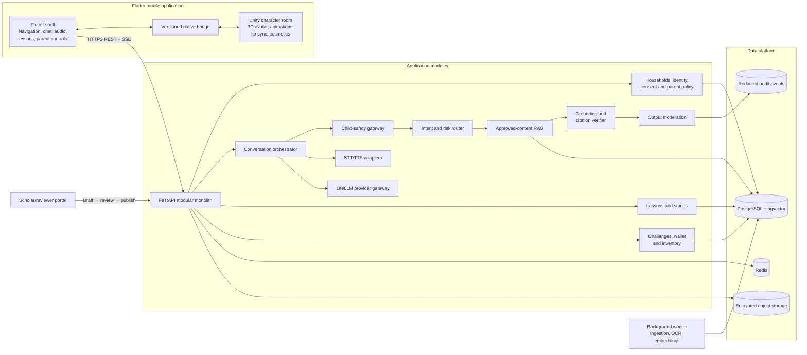

# Islamic Learning Companion: Product Architecture and Roadmap

## 1. Product vision

Build a child-focused mobile companion that makes learning Islamic foundations approachable and engaging. Children interact with a customizable 3D character through guided lessons, reviewed stories, typed questions, and eventually privacy-preserving voice input. They complete learning and real-life practice challenges to earn cosmetic rewards.

The companion is designed to support families and educators. It must not represent itself as an Islamic authority, issue fatwas, claim to validate worship, or replace a parent, teacher, or qualified scholar.

## 2. Planning assumptions

### Confirmed delivery direction (2026-09-21)

The first product target is an Android phone app, not a website. Flutter sends user chat requests to the backend; all AI inference and agent orchestration execute on the backend. Unity renders the character and receives sanitized presentation cues only. No on-device AI inference or model-provider credentials belong in the phone app.

The character-first main page should follow the supplied mobile `assets/ui.make` layout while retaining the existing ivory, teal and orange colors. Robert should use the supplied 3D model, gentle idle animation, blinking and brief reactions while visible, with background pause, reduced-motion support and static fallback. The native composition must be validated against the full-screen Unity boundary in section 4.2; a browser preview is not evidence of Android integration.

This clarification selects the delivery platform and inference location. It does not waive governance, provider review, privacy, device testing, or server-authoritative progress/rewards requirements. Current development builds still have no enabled AI provider.

The baseline design assumes:

- An initial audience around ages 7–11.
- One launch market, primary language, and approved curriculum framework.
- Guardian-created households with pseudonymous child profiles.
- No child-to-child messaging or public user-generated content.
- No advertising or behavioral tracking.
- One-to-one interaction between the child and the character.
- Push-to-talk voice rather than continuous listening.
- A reviewed corpus small enough for PostgreSQL and `pgvector`.
- Earned cosmetics rather than a complex real-money marketplace.

Age, market, language, and scholarly policy must be finalized during discovery because they affect content, consent, moderation, app-store classification, vendors, and evaluation.

## 3. Product principles

1. **Safety before engagement.** Do not optimize retention at the expense of a child's privacy, wellbeing, or relationship with trusted adults.
2. **Evidence before fluency.** A natural answer without approved evidence is a failure, not a success.
3. **Education, not authority.** The character teaches reviewed material and acknowledges uncertainty.
4. **Parents remain in control.** Guardians control consent, voice, content scope, schedules, purchases, and deletion.
5. **Respect accepted differences.** Do not silently blend or misrepresent recognized scholarly positions.
6. **Reward learning without manipulating worship.** Cosmetics reward effort and progress, not spiritual worth.
7. **Graceful degradation.** Lessons and chat remain usable if Unity, speech, retrieval, or a model provider fails.

## 4. Recommended architecture

Use a Flutter-owned mobile application, a replaceable full-screen Unity character experience, and a modular FastAPI backend.



### 4.1 Flutter responsibilities

Flutter owns:

- Login, household and child-profile selection.
- Guardian PIN and step-up authentication.
- Navigation, lessons, subtitles, chat, challenges, rewards, settings, and accessibility.
- Microphone permissions, push-to-talk capture, local silence trimming, and retry state.
- All backend networking, authentication tokens, reconnection, and offline caching.
- Unity lifecycle coordination and a static-character fallback.

### 4.2 Unity responsibilities

Unity owns:

- 3D character rendering.
- Animation graphs, facial expressions, gaze, touch reactions, and idle behavior.
- Cosmetic presentation from allowlisted catalog identifiers.
- Lip-sync from sanitized viseme, word-timing, or amplitude cues.

Unity does not own authentication, consent, business rules, networking, rewards, trusted inventory, conversation state, or safety policy.

Unity-as-a-Library should be treated as a full-screen character room rather than a lightweight Flutter widget. On Android and iOS it supports full-screen rendering, retains a significant memory footprint after unloading, permits only one runtime instance, and has additional iOS lifecycle limitations. Prototype startup time, memory, frame rate, binary size, and crash behavior before making it a permanent dependency.

Reference: [Unity as a Library](https://docs.unity3d.com/6000.0/Documentation/Manual/UnityasaLibrary.html).

### 4.3 Flutter–Unity bridge

Use a thin native bridge:

```text
Flutter MethodChannel/EventChannel
    ↕
Android/iOS native host
    ↕
Unity native messaging interface
```

Begin with versioned JSON envelopes:

```json
{
  "schemaVersion": 1,
  "messageId": "uuid",
  "type": "avatar.play",
  "sequence": 42,
  "payload": {
    "animation": "happy_nod",
    "intensity": 0.7
  }
}
```

Example Flutter-to-Unity events:

- `avatar.initialize`
- `avatar.set_emotion`
- `avatar.play`
- `avatar.set_cosmetics`
- `speech.started`
- `speech.visemes`
- `speech.stopped`
- `app.pause`
- `app.resume`

Example Unity-to-Flutter events:

- `unity.ready`
- `avatar.tapped`
- `animation.completed`
- `asset.failed`
- `unity.diagnostic`

Use acknowledgements for initialization and equipment changes. Animation cues may be best-effort. Capability negotiation should safely disable unsupported features when app and Unity versions differ.

### 4.4 Backend shape

Start with a modular monolith rather than microservices:

- One FastAPI codebase.
- One API process for REST and Server-Sent Events.
- One worker process for ingestion, embeddings, speech jobs, and notifications.
- Managed PostgreSQL with `pgvector`.
- Redis for rate limits, short-lived state, queue transport, and event replay.
- Encrypted object storage for approved originals, generated audio, and versioned asset bundles.

Keep internal packages for `accounts`, `controls`, `conversation`, `safety`, `content`, `speech`, `challenges`, `rewards`, and `admin`. Modules should communicate through domain interfaces rather than directly modifying one another's tables.

LangChain may implement retrieval and workflow composition. LiteLLM is the only model-provider adapter. Prompts, provider rules, retry policies, safety decisions, fallbacks, and versioning remain application-owned.

## 5. Conversation and speech flow

### 5.1 Safe turn flow

1. Flutter submits typed text or a bounded push-to-talk recording.
2. The backend validates size, duration, MIME type, session policy, and rate limits.
3. Speech is transcribed; raw audio is deleted immediately after its approved purpose by default.
4. Input safety checks detect personal information, sexual content, violence, self-harm, abuse or grooming disclosures, hate, dangerous instructions, prompt injection, and unsupported topics.
5. A server-side router selects deterministic curriculum content, reviewed story content, approved RAG, a safeguarding response, or a gentle refusal.
6. Retrieval is filtered by published corpus release, language, age band, locale, and selected curriculum policy.
7. The model generates structured output containing source chunk IDs and conservative avatar cues.
8. A verifier checks citation resolution and support for material religious claims.
9. Output moderation and age-appropriateness checks run.
10. Safe sentence-sized segments are streamed to Flutter.
11. Text-to-speech produces audio and timing information when enabled.
12. Flutter plays audio and sends only presentation cues to Unity.

Do not expose raw token-by-token generation to children. Validate a complete sentence or short semantic segment before displaying or speaking it.

### 5.2 Client/backend protocol

Prefer REST plus Server-Sent Events for the MVP:

```text
POST   /v1/auth/session
POST   /v1/auth/refresh
GET    /v1/household
GET    /v1/profiles
POST   /v1/profiles
GET    /v1/profiles/{id}/parent-policy
PUT    /v1/profiles/{id}/parent-policy

POST   /v1/conversations
POST   /v1/conversations/{id}/turns
POST   /v1/conversations/{id}/voice-turns
GET    /v1/turns/{id}
GET    /v1/turns/{id}/events
DELETE /v1/conversations/{id}

GET    /v1/challenges/today
POST   /v1/challenges/{id}/progress-events
GET    /v1/rewards
GET    /v1/inventory
PUT    /v1/equipped-cosmetics

POST   /v1/admin/sources
POST   /v1/admin/source-versions/{id}/review
POST   /v1/admin/corpus-releases
GET    /v1/admin/safety-events
```

All write endpoints should support idempotency keys. A client reconnects to an existing turn and resumes events rather than submitting the message twice. Add WebSockets only when full-duplex audio or interruption is a demonstrated requirement.

### 5.3 Voice privacy

Child voice recordings may be personal information. Use:

- Hold-to-talk rather than continuous listening.
- A persistent listening indicator.
- Local voice-activity detection and silence trimming.
- Bounded audio duration and upload size.
- Ephemeral server-side transcription buffers.
- Immediate deletion of raw audio by default.
- No voice identification, voiceprints, or emotion inference.
- Transcript confirmation when recognition confidence is low.
- A text fallback when speech providers fail.

Voice should not enter a pilot until deletion has been technically demonstrated end to end and provider retention/training terms have been reviewed.

Reference: [FTC COPPA FAQ](https://www.ftc.gov/business-guidance/resources/complying-coppa-frequently-asked-questions).

## 6. RAG and religious-content governance

### 6.1 Governance ownership

Establish:

- A named scholarly editorial board.
- A curriculum editor.
- A child-safeguarding lead.
- A privacy/security owner.
- An accountable product owner.

The board approves doctrine, source eligibility, translations, accepted-difference handling, sacred-figure depiction, citation rules, challenge wording, and escalation language.

### 6.2 Source hierarchy

The approved source register may include:

- Licensed Qur'an Arabic text and approved translations.
- Approved tafsir.
- Authenticated hadith editions with grading metadata.
- Board-approved fiqh and curriculum material.
- Reviewed story scripts and educational explanations.

The production retriever never searches the open web.

### 6.3 Ingestion pipeline

1. Register title, edition, publisher, language, license, checksum, and provenance.
2. Extract text while preserving page, chapter, verse, narration, grading, and section identifiers.
3. Preserve canonical Arabic separately from normalized search text.
4. Chunk by semantic religious units rather than arbitrary token windows.
5. Add topic, age, language, curriculum/madhhab, authority, and allowed-use metadata.
6. Run extraction checks and duplicate detection.
7. Obtain qualified human approval.
8. Generate embeddings and publish an immutable corpus release.

Draft and published content remain isolated. Corpus releases support one-step rollback and emergency quarantine.

### 6.4 Query policy

1. Detect language, age policy, intent, risk level, and curriculum policy.
2. Route high-risk or unsupported requests before generation.
3. Perform metadata-filtered hybrid lexical/vector retrieval.
4. Rerank approved candidates.
5. Generate only from retrieved evidence and include chunk IDs.
6. Verify that citations resolve and claims are supported.
7. Apply religious-policy and child-safety checks.
8. Return the answer or abstain.

If evidence is insufficient, the character should say it cannot answer reliably from its approved sources and suggest an appropriate trusted adult or qualified scholar. It must not silently fall back to pretrained model knowledge.

### 6.5 Differences of opinion

Separate content into:

- Agreed foundational material.
- Accepted differences of opinion.
- The family's explicitly selected curriculum practice.
- Disputed or advanced questions requiring a human scholar.

Never infer a family's madhhab. If none is selected, teach only board-designated common foundations and explain that some details may differ.

## 7. Safety and safeguarding

Safety is layered rather than delegated to one moderation call:

- Input classification and personal-information minimization.
- Server-side age and guardian-policy enforcement.
- Published-corpus-only retrieval.
- Prompt-injection isolation.
- Citation and groundedness verification.
- Output moderation before release.
- Rate, time, cost, and conversation-length limits.
- Redacted human-review queues with role-based access and short retention.
- Versioned policies, prompts, models, retrievers, and corpus releases.

High-risk situations use deterministic, reviewed, localized responses. The model must never invent a helpline, fatwa, emergency procedure, or safeguarding instruction.

For distress, abuse, grooming, sexual disclosures, or self-harm:

- Respond compassionately.
- Encourage contact with a safe nearby adult or qualified local service.
- Avoid unnecessary probing.
- Never promise secrecy.
- Do not automatically notify the guardian.
- Follow jurisdiction-specific playbooks created by safeguarding professionals and counsel.

Do not automatically ban children for inappropriate questions. Use friendly boundaries, topic redirection, cooldowns, and parent-visible high-level controls. Reserve suspension for adult-account abuse, fraud, or security threats.

## 8. Privacy and parental controls

Guardian controls should cover:

- Consent receipts and policy versions.
- Voice permission.
- Lesson and content scope.
- Usage schedules and break reminders.
- Challenge approval.
- Purchases and spending limits.
- Data export and deletion.
- Conversation and full child-profile deletion.

Give parents learning summaries rather than covert raw-chat surveillance. If transcript history is ever offered, it should be opt-in, short-retention, visible to the child, and deletable.

Avoid advertising, third-party behavioral analytics, trackers, contacts, precise location, and camera-based proof. Apple expects parental gates and age-appropriate experiences in its Kids category, and Google applies additional Families policies to child-targeted applications.

References:

- [Apple: Design safe and age-appropriate experiences](https://developer.apple.com/kids/)
- [Apple App Review Guidelines](https://developer.apple.com/app-store/review/guidelines/)
- [Google Play Families Policy](https://support.google.com/googleplay/android-developer/answer/9893335)
- [FTC Children's Privacy](https://www.ftc.gov/business-guidance/privacy-security/childrens-privacy)
- [ICO Children's Code](https://ico.org.uk/for-organisations/uk-gdpr-guidance-and-resources/childrens-information/childrens-code-guidance-and-resources/age-appropriate-design-a-code-of-practice-for-online-services/)

These references inform product design but do not replace market-specific legal advice.

## 9. Challenges, rewards, and cosmetics

### 9.1 Verification

Use:

- In-app knowledge checks.
- Child self-confirmation.
- Optional guardian approval.

Do not require prayer videos, bedroom photos, geolocation, continuous sensors, or persistent voice samples. Movement recognition is a later opt-in research project requiring privacy analysis, representative testing, scholar-defined labels, and measured false-positive/negative rates.

The app must never claim to determine whether worship was spiritually valid or accepted.

### 9.2 Reward design

- Reward learning effort, practice, and lesson completion.
- Keep child-facing currency earn-only during the MVP.
- Avoid loss-framed streaks, public rankings, shame, fear, manipulative scarcity, and claims of divine disappointment.
- Do not use loot boxes or paid randomness.
- Put any future purchases behind guardian authentication and store controls.

The server owns the wallet and inventory. Use an append-only reward ledger with idempotency keys. Flutter and Unity may request actions but never report an authoritative balance.

## 10. Key data entities

- `User`: authenticated adult.
- `Household`: ownership and entitlement boundary.
- `ChildProfile`: pseudonymous display data, age band, locale, avatar, and curriculum profile.
- `GuardianConsent`: consent type, policy version, timestamps, and jurisdiction context.
- `ParentPolicy`: voice, retention, content, schedule, and spending settings.
- `DeviceSession`: token family, platform, push token, and revocation state.
- `Conversation`, `Turn`, and `Message`: bounded interaction lifecycle.
- `ModelRun`: provider, model, prompt version, latency, cost, and safety outcome.
- `Citation`: answer-to-source evidence mapping.
- `SafetyEvent`: redacted policy decision and review state.
- `Source`, `SourceVersion`, `SourceChunk`, `ContentReview`, and `CorpusRelease`.
- `Lesson`, `Story`, `Challenge`, `ChallengeStep`, and `ProfileProgress`.
- `RewardLedger`, `CosmeticCatalogItem`, `ProfileInventory`, and `EquippedCosmetic`.

Do not place child utterances, voiceprints, distress disclosures, names, or inferred religious beliefs in the vector database.

## 11. Failure behavior

- **Unity failure:** Show Flutter's static avatar and preserve lessons/chat.
- **Bridge mismatch:** Negotiate capabilities and disable unsupported animations or cosmetics.
- **Network/SSE disconnect:** Resume using the turn ID and last received event.
- **Duplicate retry:** Return the result associated with the idempotency key.
- **STT failure:** Preserve retry state and offer typed input.
- **TTS failure:** Deliver text with neutral animation.
- **Model failure:** Use only an approved fallback within the latency budget; otherwise show a safe unavailable response.
- **Weak or unavailable retrieval:** Use an adequate deterministic/lexical recovery or abstain.
- **Unsafe generated output:** Cancel TTS, replace it with a reviewed safe response, and create a redacted safety event.
- **Compromised content:** Quarantine the source and roll back to the previous immutable corpus release.
- **Corrupt cosmetic asset:** Validate hashes/signatures and retain the previous equipped item.

## 12. Observability and evaluation

Propagate a correlation ID through Flutter, the API, retrieval, model calls, speech, workers, and the Unity bridge. Use redacted structured logs, metrics, traces, and crash reporting.

Track:

- End-to-end latency and time to first safe response segment.
- STT, retrieval, model, verification, and TTS latency separately.
- Retrieval hit rate, citation validity, groundedness, abstention, and refusal rates.
- Safety-route accuracy and critical-response failures.
- Provider errors, fallbacks, rate limits, and cost ceilings.
- SSE reconnects and duplicate submissions.
- Unity crashes, memory, startup time, frame rate, and bridge mismatches.
- Reward-ledger duplicate attempts and reconciliation failures.
- Lesson completion, comprehension, parent trust, and support burden.

Maintain a reviewed evaluation set across supported languages covering foundational questions, ambiguous doctrine, accepted differences, adversarial prompts, prompt injection, fabricated citations, personal-data leakage, abuse disclosures, age appropriateness, and refusals. Run it before any model, prompt, policy, embedding, retriever, or corpus change.

Ordinary telemetry must not contain raw child prompts, transcripts, audio, personal data, or full retrieved passages.

## 13. MVP scope

### Include

- One character and one lightweight Unity room.
- Flutter onboarding, guardian controls, lessons, chat, progress, rewards, and settings.
- One launch language and one approved curriculum policy.
- Three to five guided modules.
- Six to ten reviewed stories.
- Constrained text Q&A over the approved corpus.
- Feature-flagged push-to-talk after the voice privacy gate passes.
- Child-confirmed or guardian-approved challenges.
- Earn-only currency and a small cosmetic catalog.
- Parent-visible source cards and reporting tools.
- Static-avatar fallback.

### Exclude

- Camera or body-motion verification.
- Open-ended religious rulings.
- Open-web retrieval.
- Child-to-child messaging.
- Long-term conversational memory.
- Advertising and behavioral tracking.
- Public profiles and leaderboards.
- Paid randomness.
- Unrestricted generative storytelling.
- Broad multilingual or multi-curriculum expansion.

## 14. Delivery roadmap

A responsible controlled launch is approximately 8–12 months with a seven-to-nine-person core team, assuming source licensing and governance decisions do not stall.

| Phase | Indicative time | Deliverables | Exit criteria |
|---|---:|---|---|
| 0. Product and governance | 4–6 weeks | Select age, market, language, and curriculum; establish boards, source register, privacy model, risk assessment, incident policy, success metrics, and exclusions | Named approvers; source rights confirmed; consent, retention, deletion, and escalation flows approved |
| 1. Risk prototypes | 4–6 weeks | Throwaway Flutter–Unity bridge; low-end-device tests; one sample learning/reward loop; RAG evaluation set; parent-consent prototype | Unity meets startup, memory, FPS, size, and crash budgets or is dropped; retrieval and safe fallback meet agreed thresholds |
| 2. Vertical slice | 6–8 weeks | One lesson, one reviewed story, text chat, one challenge, one reward, one cosmetic, and a static-avatar fallback | Complete child journey works; religious claims are traceable; analytics contain no raw child content |
| 3. MVP build | 10–14 weeks | Flutter child/guardian flows, FastAPI modules, review portal, Unity room, lessons, reward ledger, inventory, export/deletion, and automated tests | All content is reviewed; high-severity threats closed; consent withdrawal and deletion verified |
| 4. Closed pilot | 6–8 weeks | 30–50 invited families; text first, then feature-flagged voice; weekly scholar and safety review; incident/support runbooks | No unresolved critical incident; parents understand controls; children complete core lessons without excessive adult help |
| 5. Limited beta | 8–12 weeks | 200–500 consented families; wider device coverage; load tests; accessibility audit; operational dashboards; external privacy/security review | At least 99.5% crash-free sessions; safety gates pass; support and content-review workload are sustainable |
| 6. Launch | 4–6 weeks | Staged regional release, store review, transparency center, monitoring, kill switches, rollback, and disaster recovery | Store approval; rollback drill passed; scholar, safeguarding, privacy, security, and operations sign-off |
| 7. Expansion | Evidence-led | Additional languages, reviewed modules, curriculum variants, offline support, cost optimization, and carefully evaluated recognition features | Every expansion passes governance, evaluation, privacy, and pilot gates |

## 15. Team

A realistic core team is:

- Product lead.
- Child UX/research designer.
- Two Flutter engineers.
- Two backend/AI engineers.
- One Unity engineer, potentially fractional after stabilization.
- QA/automation engineer.
- Platform/security support.
- Islamic scholars and curriculum editor.
- Child-safeguarding, privacy, and legal advisors with milestone-gate authority.

## 16. Major risks and mitigations

| Risk | Mitigation |
|---|---|
| Unsupported or inaccurate religious guidance | Approved corpus, explicit content policy, claim-level citations, grounding verifier, abstention, scholar review, immutable releases, rollback |
| Unclear differences of opinion | Document the selected framework, label recognized differences, never infer madhhab, escalate advanced questions |
| Child privacy or unsafe interaction | Data minimization, guardian controls, ephemeral voice, no ads/social features, deletion tests, safeguarding playbooks |
| Prayer/action recognition overpromises | Exclude from MVP; later opt-in research with representative evaluation and no claims of religious validity |
| Flutter–Unity instability | Prototype first, enforce performance budgets, isolate Unity, provide static Flutter fallback |
| Harmful gamification | No paid randomness, public rankings, shame, streak loss, or spiritual-worth messaging |
| Content review becomes a bottleneck | Structured author/review/publish workflow, small initial catalog, explicit reviewer capacity |
| Model/provider change causes regression | Provider allowlist, versioning, feature flags, evaluation gates, canary releases, and kill switches |
| Scope expansion delays validation | Freeze MVP exclusions until pilot evidence supports expansion |

## 17. Scale-out path

Scale only in response to measured pressure:

1. Scale API and worker replicas independently while retaining one database.
2. Move OCR, embeddings, and ingestion to a dedicated worker pool.
3. Add a real-time gateway only when full-duplex WebSockets require different scaling.
4. Extract speech orchestration if audio concurrency becomes dominant.
5. Extract conversation/AI orchestration if its compliance boundary, release cadence, or load differs materially.
6. Add an outbox and event bus when extracted domains require reliable asynchronous events.
7. Replace `pgvector` only when corpus size, Arabic retrieval quality, or measured latency requires it.
8. Add regional data planes and residency routing only when launch markets require them.

## 18. Decisions required before implementation

1. Exact target age band.
2. First launch country or regulatory market.
3. First language.
4. Scholarly/curriculum framework and policy for accepted differences.
5. Whether public version one must include voice or voice may follow the text pilot.
6. Initial business model and whether any paid cosmetics will exist.
7. Minimum supported mobile devices and measurable Unity performance budgets.

These decisions should be recorded as architecture decision records and reflected in the content policy, data model, evaluation suite, and release gates.
