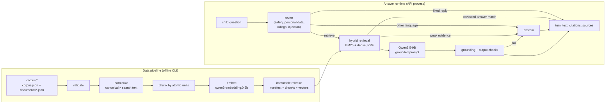

# RAG system and data pipeline

Status: implemented as a development increment on synthetic data (branch
`feature/rag-system-and-data-pipeline`, 2026-09-25). Nothing here is approved for
children. The scholarly, safeguarding, privacy and legal gates in
[`development-boundary.md`](development-boundary.md) are still open, and
[ADR 0003](adr-0003-grounded-answers-development.md) records the boundary for
this work and what still gates any child use. This builds the machinery those
gates will review, and it is **off by default**.

This document is the contract between the data pipeline, the answer runtime and
the Flutter client. Section numbers are referenced from code comments, so they
stay stable; later additions are new subsections or new sections at the end.
Where the implementation settled a detail the first draft left open, or
departed from it, the text below says what the code does and §12 records the
change and why.

## 1. Shape



Model inference is self-hosted: an OpenAI-compatible server (Ollama by default,
llama.cpp or vLLM also work) on this machine or a private network serves
`qwen3.5:9b` for generation and `qwen3-embedding:0.6b` for embeddings.
`rag/endpoints.py` refuses any other host, because sending a child's question to
a third-party provider is what the provider due-diligence gate decides.

## 2. Package layout

`src/companion_api/rag/`

| Module | Owner | Purpose |
|---|---|---|
| `types.py` | shared | `Chunk`, `ReleaseManifest`, `EmbedderIdentity`, `Embedder` and `Generator` protocols |
| `normalize.py` | shared | canonical vs search text, tokens, language detection (`norm-v1`) |
| `embeddings.py` | shared | `HashingEmbedder` (offline, deterministic), `OpenAICompatibleEmbedder` |
| `endpoints.py` | shared | private-endpoint guard |
| `release.py` | shared | write/load/verify immutable releases |
| `corpus.py` | pipeline | document schema, loading, validation report |
| `markdown.py` | pipeline | Markdown authoring format → document JSON |
| `chunking.py` | pipeline | unit-preserving chunker (`chunk-v1`) |
| `pipeline.py` | pipeline | `python -m companion_api.rag.pipeline` CLI |
| `lexical.py` | runtime | BM25 over search text |
| `retriever.py` | runtime | hybrid retrieval, filters, fusion, thresholds |
| `router.py` | runtime | deterministic input routing (development rules) |
| `responses.py` | runtime | fixed replies (development copy, awaiting review) |
| `prompts.py` | runtime | versioned grounded-answer prompt |
| `generator.py` | runtime | OpenAI-compatible chat adapter for Qwen3.5-9B |
| `grounding.py` | runtime | citation parsing, support check, output safety |
| `service.py` | runtime | `AnswerService`: route → retrieve → generate → verify |
| `evaluate.py` | runtime | `python -m companion_api.rag.evaluate` eval harness |
| `ask.py` | runtime | `python -m companion_api.rag.ask` operator console |

Outside the package: `config.py` reads the §9 settings and `require_rag`
validates them; `store.py` holds the §6.5 queue and turn states; `schemas.py`
and `main.py` carry the §7 shapes and routes. `service.assemble` is the one
place a release, an embedder, a retriever and a generator are put together, so
the server, the evaluator and the operator console cannot disagree about them.

## 3. Corpus authoring format (schema v1)

A corpus is a directory:

```
corpus/<corpus-id>/
  corpus.json          {"schemaVersion": 1, "id": "<corpus-id>", "title": "...", "description": "..."}
  documents/*.json     one document per file (canonical form)
  documents/*.md       optional Markdown authoring form (§3.3), converted on load
  eval.json            optional evaluation cases (§8)
```

### 3.1 Document

```json
{
  "schemaVersion": 1,
  "id": "app-help-stars",
  "kind": "passage",
  "title": "How learning stars work",
  "language": "en",
  "ageBands": ["7-9", "10-11"],
  "contentType": "app_help",
  "madhhab": [],
  "curriculumPolicy": "dev-synthetic",
  "synthetic": true,
  "source": {
    "work": "Robert's guide", "edition": "dev-1", "publisher": "Companion team",
    "translator": null, "license": "internal", "checksum": null
  },
  "grading": null,
  "review": {"status": "draft", "reviewer": null, "approvedOn": null, "supersedes": null},
  "units": [
    {"id": "u1", "text": "…", "reference": "part 1", "section": "Earning", "keepWithNext": false}
  ]
}
```

- `id`: `^[a-z0-9][a-z0-9-]{1,63}$`, unique across the corpus.
- `kind`: `passage` (units are retrieved and cited) or `answer` (reviewed
  answer-bank entry: `questions` — 1–12 phrasings — and `answer` replace
  `units`).
- `language`: `en` or `ar` for now. `ageBands`: any of `5-6`, `7-9`, `10-11`, `12-14`.
- `contentType`: `app_help`, `orientation`, `lesson`, `story`, `quran`,
  `tafsir`, `hadith`, `dua`, `fiqh`.
- **Units are atomic.** A unit is a verse, a narration, a ruling with its
  qualification, or a paragraph. The chunker never splits one, never crosses a
  `section` boundary, and never separates a unit marked `keepWithNext` from the
  unit after it.

### 3.2 Validation rules (errors fail the build)

1. Schema: required fields, types, id patterns, unique document ids, unique
   unit ids within a document, non-empty text, `units` xor `questions`+`answer`.
2. **Synthetic content is never religious.** `synthetic: true` requires
   `contentType` of `app_help` or `orientation`. Invented religious text is the
   one thing this pipeline must not make easy.
3. Non-synthetic documents require `source.work`, `source.edition`,
   `source.publisher` and `source.license`. `hadith` requires `grading`.
   `quran` requires a `reference` on every unit.
4. `review.status: "approved"` requires `review.reviewer` and an ISO
   `review.approvedOn`.
5. Duplicate detection: two units (or answers) whose search text is identical
   are an error; near-duplicates (token Jaccard ≥ 0.9) are a warning.
6. Oversized units (more than the chunk budget) are a warning, not a split.

The validation report lists `file`, `document`, `field`, `severity`, `message`
(and a `line` for Markdown and JSON syntax errors). It reports every problem in
one pass and names fields and ids but never quotes document text, so it can be
pasted into a ticket. Canonical text is never rewritten, only NFC-composed and
trimmed.

The pipeline also checks what the rules above leave implicit:

- **Errors:** an unknown field (with the closest allowed name, so a misspelling
  is caught instead of silently ignored); a key repeated in one JSON object; a
  file that is not UTF-8 or not valid JSON (with line and column); an item listed
  twice in a list; an empty `ageBands`; a `review.approvedOn` that is not an ISO
  date, whatever the status; `keepWithNext` on a unit whose next unit starts a
  new section; a reviewed answer over 1200 characters (it is returned verbatim
  as the turn text, §7); the same question phrasing twice in one answer or in two
  answer documents (each phrasing belongs to one reviewed answer); a document id
  used by two files, such as the `.md` and `.json` form of one document; a
  missing `corpus.json` or `documents/` folder, or no documents; and in
  `eval.json`, a duplicate or malformed case id, a question over the API's 2000
  characters, an unknown answer type, or an expected document that is not in
  the corpus.
- **Warnings:** text that looks like another language than the document's
  `language` (retrieval filters by language, so it would never be found);
  `keepWithNext` on the last unit; a `keepWithNext` group over the chunk budget;
  a synthetic document without `source.work` (citations then show the title); a
  file name that does not match the document id; a file in `documents/` that is
  not `.json` or `.md` (ignored); `expect.documents` on a case that expects
  neither `grounded` nor `reviewed_answer` (it is not checked there).

### 3.3 Markdown authoring form

For people writing content by hand. Front matter is flat `key: value` lines
between `---` fences; lists are comma-separated; dotted keys fill nested
objects (`source.work: Robert's guide`). `## Heading` starts a `section`. Each
blank-line-separated paragraph is one unit; a trailing `{ref: part 1}` sets its
reference and `{keep-with-next}` sets `keepWithNext`. Answer documents use
`kind: answer`, a `questions:` list (separated by ` | `) and the body as the answer.
`python -m companion_api.rag.pipeline import-markdown <in> <out>` writes the
canonical JSON; loading also accepts `.md` directly.

## 4. Chunking (`chunk-v1`)

- Passage documents: group consecutive units of one section until the next unit
  would exceed `maxChunkWords` (default 180). A single unit over the budget is
  its own chunk. `keepWithNext` pairs are one group.
- Answer documents: exactly one chunk; `text` is the answer, `questions` carries
  the phrasings, `searchText` covers both.
- Chunk ids: `<documentId>#<n>`, n from 1, stable for the same input.
- `sourceLabel`: `"<source.work> · <first reference>[–<last reference>]"`.
- Embedding input is `"<title>\n<text>"` (answers: questions, then answer).

## 5. Releases

Written by `release.write_release`, verified by `release.load_release` (see its
docstring for the layout). `channel` is `development` unless every document is
approved and non-synthetic, in which case the builder may write `published`.
The manifest records the embedder identity, `pipeline`
(`{"normalizer": "norm-v1", "chunker": "chunk-v1", "maxChunkWords": 180}`) and
`review` counts. Releases live outside git (`releases/` is ignored).

**Serving rule.** `Chunk.servable` — approved, or synthetic development copy.
The API retrieves only servable chunks. The operator console and the evaluator
may include drafts with `--include-drafts`; nothing child-facing can. Because
validation refuses synthetic religious content (§3.2 rule 2), the synthetic
exception admits only app help and orientation, and real content is served only
once approved.

The server does not check a release's `channel`: with grounded answers enabled
it serves a `development` release. That is what makes this development-only.
The child experience may retrieve only from published, scholar-approved
releases (`AGENTS.md`), so serving only `published` releases, with the
synthetic exception removed, is one of the gates in ADR 0003.

## 6. Answer runtime

### 6.1 Routing (before any model call)

`router.route(text) -> Route` with `category` one of `safety`, `personal_data`,
`ruling`, `injection`, `retrieve`, and a fixed `reason_code`. Development rules
(`dev-patterns-v1`) are keyword and pattern lists, clearly labelled as not an
approved safeguarding classifier; they fail towards the fixed replies. The
order is fixed: safety first, then personal data, rulings and injection. Safety
→ `safety` answer; personal data, rulings and injection attempts →
`redirected`. The fixed replies in `responses.py` are development copy awaiting
safeguarding and scholarly review; none promises secrecy, names a helpline (that
depends on the launch jurisdiction) or speaks with religious authority.

Patterns match whole words of `router.matchable(text)`: the search text with
apostrophes and transliteration marks joined rather than split, and diacritics
dropped, so "Don't", "dont" and "DON'T", or "Shafi'i" and "Shafii", read the
same. Emails, phone numbers and prompt delimiters (chat-template tokens,
`<system>`-style tags, `NOT_IN_SOURCES`) depend on punctuation that search text
removes, so those rules match the NFKC-composed raw text instead.

A `SafetyClassifier` protocol leaves room for a guard model (for example
Qwen3Guard) behind the same interface. It runs only after the rules let a
question through and can only add diversions: it cannot turn a fixed reply
back into retrieval.

**Service language.** After routing and before retrieval, a question whose
detected language is not the service's (`en` in development) abstains with
outcome `language_mismatch`, without retrieval or a model call. The patterns
read English only, apart from two Arabic ruling patterns, so a question in
another language would pass them unread. `normalize.detect_language` tells only
Arabic from Latin script, so today this catches Arabic-script questions; a
question in another Latin-script language is routed as if it were English.

### 6.2 Retrieval

Hybrid (`hybrid-rrf-v1`): BM25 over `searchText` and cosine over vectors, each
top-20, fused with reciprocal rank fusion (k = 60); top 4 go to the prompt.
Filters: servable, language (profile language, `en` in development), age band
when given (the API gives none yet: it has one synthetic profile). Weak
evidence — no BM25 hit among the eligible chunks and best cosine under the
embedder's threshold, or no eligible chunk at all — abstains without calling the
model. Thresholds are in §6.7.

The BM25 index covers each chunk's search text. For an answer chunk it also
covers a reviewed phrasing, but only when that phrasing is not already part of
the search text: the pipeline puts the questions there (§4), and counting them
twice would inflate their term frequency.

**Reviewed answers first.** Every `answer` chunk among the top 4 is checked, in
rank order, against its reviewed `questions`: the first whose phrasing matches
the question closely (token Jaccard ≥ 0.6 over content words) is returned
verbatim as `reviewed_answer`. Only when no phrasing matches does the cosine
test apply, and only to the top candidate: an `answer` chunk ranked first with
cosine ≥ the reviewed-answer threshold is returned. In both cases the model is
not called. Checking the top candidate alone is not enough: a sibling answer
that repeats the subject ("Robert") can outrank the entry holding the child's
exact question, and even clear the cosine threshold, because one repeated word
dominates both vectors, and its text would then be returned verbatim for the
wrong question.

### 6.3 Generation

`generator.OpenAICompatibleGenerator` posts to `{base}/chat/completions` with
`model` (allowlisted: `qwen3.5:9b`, `qwen3.5:9b-*`, `Qwen/Qwen3.5-9B`),
temperature 0.3, top_p 0.8, `max_tokens` 320, no streaming, and thinking
disabled two ways: `"reasoning_effort": "none"` (Ollama) and
`"chat_template_kwargs": {"enable_thinking": false}` (llama.cpp, vLLM). Any
`<think>…</think>` block is stripped (an unclosed leading one means the output
was cut off while reasoning, so there is no answer) and
`reasoning`/`reasoning_content` fields are never read. Errors carry a status or
an exception type, never request or response content. Prompt `rag-answer-v1`
(in `prompts.py`) numbers the passages, marks them as evidence rather than
instructions, and requires every sentence to end with a citation like `[1]`, or
the exact reply `NOT_IN_SOURCES`. Passages and the question sit in delimited
blocks, and anything in them that looks like a delimiter, a chat-template
token, a citation marker or the sentinel is neutralized first.

### 6.4 Verification (before release)

Every sentence must be attributed to at least one passage that exists: by its
own `[n]` marker, or by the next marker when the model cites once at the end of
a short run (at most two uncited sentences directly before a marker, which
Qwen3.5-9B writes in about two answers out of five). At least half of each
sentence's content words must be found in the passages it is attributed to
(§6.7), carried or not; the answer
must pass output checks (length, no URLs, emails, phone numbers or markup, no
claims of religious authority, no secrecy promises). Any failure abstains. The
released text has the `[n]` markers removed; `citations` and `sources` carry
them.

The support check (`grounding-v2`) is lexical on purpose: lenient on inflection
(a shared base form or 5-character prefix counts), strict on numbers. It
cannot judge paraphrase, so it errs towards rejecting reworded answers, which
costs only an abstention. A sentence with no content words ("Yes!") counts as
unsupported, because it asserts nothing the passages can vouch for. A reply
that is only `NOT_IN_SOURCES` abstains, and so does one that mixes the sentinel
with other text. Failures are fixed codes (`missing_citation`,
`invalid_citation`, `unsupported_sentence`, `not_in_sources`, `too_long`,
`url`, `authority_claim` and so on) that reach the log as the outcome (§6.6).

### 6.5 Execution model

Routing is synchronous: a fixed reply is stored as a `completed` turn in the
request that created it, without using the queue. Everything else — the
language check, retrieval and, when needed, generation — runs on a single
background worker thread inside the API process (one GPU). At most 8 turns may
be queued or running at once: the count covers the job on the thread as well as
those waiting, so at most eight answers are ever in flight, the running one
included. A ninth returns
`503 answer_queue_full`; fixed replies are still accepted. A turn is `pending`
until its answer is stored, which includes turns that end as `reviewed_answer`
or `abstained`. Deleting the conversation while a turn is pending discards the
result. The question text lives only in that job's memory; it is never stored,
logged or embedded into the release. `AnswerService.answer` never raises: any
error becomes the abstention reply. Production moves this to the worker
process.

On shutdown, queued jobs are cancelled. A generation already running keeps its
worker thread until the model call returns or reaches
`COMPANION_LLM_TIMEOUT_SECONDS`, and its answer is discarded.

### 6.6 Provenance and logs

Each answer logs one line on `companion_api.rag`, fixed replies included:

```
INFO:     companion_api.rag rag_answer {"answer_type": "reviewed_answer", "embedder": "hashing/hashing-v1", "latency_ms": 1, "model": "qwen3.5:9b", "outcome": "reviewed_match", "passages": 1, "prompt_version": "rag-answer-v1", "release_id": "dev-app-help-hashing", "retriever": "hybrid-rrf-v1", "verifier": "grounding-v2"}
```

The fields are answer type, release id, model, prompt version, retriever,
verifier and embedder versions, number of passages and latency, plus an
`outcome` code for everything except a fixed reply (whose route the answer type
already implies): `reviewed_match`, `grounded`, `weak_evidence`,
`language_mismatch`, `grounding:<failure>` or `error:<exception type>`. The same
code is `AnswerResult.reason`, where fixed replies read `route:<category>`.
Errors log a separate warning with the exception type only. Never the
question, the passages or the answer.

Uvicorn configures only its own loggers, so when the server builds the service
from its settings it attaches a stream handler at INFO to `companion_api.rag`
(unless that logger already has one); otherwise the line would be dropped.

### 6.7 Thresholds and calibration

| Setting | Value | Where |
|---|---|---|
| Fusion constant | RRF k = 60 | `retriever.RRF_K` |
| Candidates per branch | 20 (BM25 and cosine each) | `retriever.BRANCH_K` |
| Passages to the prompt | 4 | `retriever.FINAL_K` |
| Weak evidence, `hashing` | no BM25 hit and best cosine < 0.2 | `retriever.THRESHOLDS` |
| Reviewed answer by cosine, `hashing` | top candidate ≥ 0.75 | `retriever.THRESHOLDS` |
| Weak evidence, `openai-compatible` | no BM25 hit and best cosine < 0.55 (measured) | `retriever.THRESHOLDS` |
| Reviewed answer by cosine, `openai-compatible` | top candidate ≥ 0.85 | `retriever.THRESHOLDS` |
| Any other embedder | the strictest pair: 0.55 and 0.85 | `retriever.STRICT_THRESHOLDS` |
| Reviewed answer by phrasing | token Jaccard ≥ 0.6, any answer chunk in the top 4 | `retriever.REVIEWED_JACCARD` |
| Grounding support | ≥ 0.5 of each sentence's content words | `grounding.MIN_SUPPORT` |
| Answer length | released text ≤ 1200 characters; raw output over 4800 refused | `grounding.MAX_CHARS` |
| Generation | temperature 0.3, top_p 0.8, `max_tokens` 320 | `generator`, `service` |

Cosine scales differ between embedders, so the cosine thresholds are per
embedder (`EmbedderIdentity.name`) and can be overridden when a
`HybridRetriever` is constructed; there is no environment variable for them.

**Calibration.** The `hashing` values were measured on the development corpus:
unrelated questions score about −0.15 to 0.13 (random hash collisions) and
related ones 0.27 and up; a reviewed phrasing asked verbatim scores about 0.84
against its answer chunk, and a different question on the same subject 0.5 to
0.65. The `openai-compatible` values for `qwen3-embedding:0.6b` were measured
on 2026-09-25 against release `dev-app-help-qwen-1`: questions the corpus
answers score 0.685 to 0.856 against their best chunk, unrelated ones 0.245 to
0.462 ("What is the weather today?" is the 0.462), so weak evidence is < 0.55
with margin on both sides. The provisional 0.45 would have let that weather
question through. Questions that name Robert but that the corpus cannot answer
("Can Robert fly?") score about 0.63; declining those is the model's and the
verifier's job, not the threshold's. A near-verbatim reviewed phrasing scores
about 0.85, which stays the reviewed-answer cutoff. Recalibrate with
`python -m companion_api.rag.evaluate` (offline for retrieval, `--generate` for
grounding and abstention) after any model, prompt, embedder or material corpus
change.

## 7. API (v1 additions)

`GET /v1/bootstrap` — `features.generativeAnswers` is `true` when the server
started with grounded answers enabled, otherwise `false`.

`POST /v1/conversations/{id}/turns` → `{"turnId": "...", "status": "pending" | "completed"}`

`completed` when grounded answers are off (the answer is the fixed
`unavailable` text) and for a fixed reply (§6.1); `pending` for everything that
goes to the answer worker (§6.5). `503 answer_queue_full` when 8 turns are
already queued or running.

`GET /v1/turns/{id}` →

```json
{
  "turnId": "…",
  "status": "pending | completed",
  "answerType": null,
  "text": "",
  "citations": [],
  "sources": []
}
```

When `completed`: `answerType` is one of `unavailable` (grounded answers are
off), `grounded`, `reviewed_answer`, `abstained`, `redirected`, `safety`;
`text` is 1–1200 characters without citation markers; `citations` is the list
of chunk ids and `sources` the same ids with display data, in the same order,
at most 4, with `title` 1–120 characters and `reference` 1–160 (the pipeline
refuses documents that could exceed either, and the client refuses the whole
reply if one does):

```json
{"id": "app-help-stars#1", "title": "How learning stars work", "reference": "Robert's guide · part 1"}
```

`sources` is empty for every type except `grounded` and `reviewed_answer`.

`GET /v1/turns/{id}/events` (SSE) — while pending, the body is only
`retry: 1000` so the client reconnects, and the only accepted `Last-Event-ID`
is `0` (nothing has been sent yet); once completed, one `segment` event per
verified sentence (`{"text", "citations"}`, ids 1..n) then `completed`
(`{"turnId", "answerType"}`, id n+1). A fixed reply, a reviewed answer and an
abstention are one segment. `Last-Event-ID` outside 0..n+1 is `422`.

With grounded answers off the stream is unchanged apart from one field: event 1
is the whole fixed text and event 2 is `completed`, which now also carries
`"answerType": "unavailable"`, so a client reads the answer type the same way in
both modes.

`DELETE /v1/conversations/{id}` also discards the answer of a pending turn: the
job finds no turn to write to.

## 8. Evaluation cases

`corpus/<id>/eval.json`:

```json
{"schemaVersion": 1, "cases": [
  {"id": "stars-1", "question": "How do I earn stars?",
   "expect": {"answerTypes": ["grounded", "reviewed_answer"], "documents": ["app-help-stars"]}},
  {"id": "ruling-1", "question": "Is it haram to …?", "expect": {"answerTypes": ["redirected"]}}
]}
```

`python -m companion_api.rag.evaluate --release <dir> --cases <eval.json>`
reports routing accuracy and retrieval recall@4 offline; `--generate` also
calls the model and reports answer-type match, grounding pass and abstention
rates. Religious content changes require the reviewed religious and
child-safety evaluation set (not yet written — it needs the scholarly board).

The evaluator builds its service through `service.assemble` from the §9
environment variables and calls `AnswerService.prepare()`, which is the API's
own path up to the model call (routing, language check, retrieval, weak
evidence, reviewed answers), so offline results predict what the API does. It
reads the outcome from `AnswerResult.reason`. Offline, a case expecting
`grounded` or `reviewed_answer` passes when the question reaches retrieval, the
evidence is not weak and an expected document is in the top 4; any other case
passes when the deterministic outcome is one it expects. Recall@4 is measured
for every case that lists documents, whatever the router did. Exit status is 0
when every case passes, 1 when any fails and 2 when the cases or the release
are refused. `--json` carries case ids and outcomes, never question text.

`corpus/dev-app-help/eval.json` has 24 development cases: 14 answerable app-help
questions (each with expected documents), two rulings, two safety disclosures,
two pieces of personal data, two injection attempts and two questions outside
the corpus.

## 9. Configuration

| Variable | Default | Meaning |
|---|---|---|
| `COMPANION_RAG_ENABLED` | `false` | kill switch; `true` loads a release and enables answers |
| `COMPANION_RAG_RELEASE` | — | path to one release directory |
| `COMPANION_LLM_BASE_URL` | `http://127.0.0.1:11434/v1` | private OpenAI-compatible endpoint |
| `COMPANION_LLM_MODEL` | `qwen3.5:9b` | must be allowlisted |
| `COMPANION_LLM_TIMEOUT_SECONDS` | `60` | per generation |
| `COMPANION_EMBEDDING_BASE_URL` | LLM base URL | private endpoint for embeddings |
| `COMPANION_EMBEDDING_MODEL` | `qwen3-embedding:0.6b` | `hashing` selects the offline embedder |

The server refuses to start with grounded answers enabled when the release is
missing or fails verification, either endpoint is not private, the model is not
allowlisted, the timeout is not 1 to 600 seconds, or the configured embedder
does not match the release's. `require_rag` names every settings problem in one
message. Only the exact value `true` enables answers.

The pipeline's `build` reads `COMPANION_EMBEDDING_MODEL`,
`COMPANION_EMBEDDING_BASE_URL` and `COMPANION_LLM_BASE_URL` when its flags are
not given, and `evaluate` and `ask` read all of these variables except
`COMPANION_RAG_ENABLED` and `COMPANION_RAG_RELEASE` (they take `--release`), so
an operator run measures what the server would do.

## 10. What this does not do yet

pgvector storage, a guard model, a reranker, follow-up question rewriting
(each turn stands alone, so no transcript is kept), Arabic answer generation
review, streaming partial answers, and the reviewed evaluation set. Each is a
separate task behind the same interfaces.

Known limitations of this increment:

- **Both models together exceed this development machine's commit limit.**
  Run against the real Qwen3.5-9B on 2026-09-25 (RTX 3060 12 GB, 16 GB RAM,
  3.5 GB fixed page file): each Ollama model runs in its own process with its
  own CUDA context, the embedder's alone commits about 3.4 GB of host memory,
  and loading Qwen3.5 (with the vision projector Ollama bundles) needs about
  5 GB more. With other applications open, the two did not fit together:
  loads failed with `std::bad_alloc` and PTX JIT "Memory allocation failure".
  Both fit in VRAM; the limit is Windows' commit charge. A larger page file (or
  more RAM) lets them co-reside; until then, the `hashing` embedder with Qwen
  generating works (§11). Ollama also needed `OLLAMA_FLASH_ATTENTION=0` on this
  GPU, because its CUDA 13 build JIT-compiles the flash-attention kernel for
  sm_86 and that compile ran out of memory.
- **Embedding dimensions are assumed.** `embeddings.embedder_for` takes no
  dimensions parameter, so every non-`hashing` model is expected to return 1024
  dimensions (`qwen3-embedding:0.6b`), at build time and at query time. Another
  model fails the build with a dimensions error rather than being supported.
- **Shutdown waits for a running generation** (§6.5), up to the model timeout.
- **Development releases are served** when enabled (§5), and the router and
  fixed replies are development copy (§6.1).

## 11. Operator commands

Run from the repository root with the virtual environment's Python. None of
these downloads a model; they call the configured private endpoint, or nothing
at all with the `hashing` embedder.

| Command | What it does | Exit status |
|---|---|---|
| `python -m companion_api.rag.pipeline validate <corpus-dir> [--json]` | the §3.2 report | 1 on errors |
| `python -m companion_api.rag.pipeline build <corpus-dir> --out <root> [--release-id ID] [--embedding-model M] [--embedding-base-url URL] [--channel development\|published] [--max-chunk-words N]` | validate, chunk, embed, write a new release; `--embedding-model hashing` works offline | 1 when refused |
| `python -m companion_api.rag.pipeline verify <release-dir>` | checksums, counts and manifest summary | 1 when refused |
| `python -m companion_api.rag.pipeline stats <release-dir>` | chunk counts by content type, language, review status and kind, and words per chunk | 1 when refused |
| `python -m companion_api.rag.pipeline import-markdown <file-or-dir> <out-dir> [--overwrite]` | §3.3 Markdown to canonical JSON; writes nothing if any file has errors | 1 on errors |
| `python -m companion_api.rag.ask --release <dir> --check` | release verified, embedder matches and answers, model allowlisted, endpoint private and serving the model | 1 on any failure |
| `python -m companion_api.rag.ask --release <dir> [--include-drafts]` | one synthetic question per stdin line; prints answer type, text, sources and outcome | 0 |
| `python -m companion_api.rag.evaluate --release <dir> --cases <eval.json> [--generate] [--include-drafts] [--json]` | §8 | 0 all pass, 1 any fail, 2 refused |

`ask --check` always checks the generation endpoint, so it fails without a
model server even for a `hashing` release. Pipeline output is counts, ids and
paths, never document text. The evaluator's human-readable output prints each
case's question, which is synthetic development text; `--json` does not.

## 12. Changes from the first draft

The first draft of this contract was written before the pipeline and the
runtime. Implementing them settled or changed the following; the sections
above already describe the result.

1. **Reviewed answers (§6.2).** Phrasing (Jaccard) is checked against every
   answer chunk in the top 4, and the cosine test applies only to the top
   candidate. The draft tested the best candidate only, which could return a
   sibling answer verbatim for the wrong question.
2. **Service language (§6.1).** A question not in the service language abstains
   before retrieval, because the router's patterns are written for English; the
   draft had no language step.
3. **Router matching (§6.1).** Apostrophes, transliteration marks and
   diacritics are folded before matching, and emails, phone numbers and prompt
   delimiters are matched on the raw text, which search normalization would
   otherwise strip of the punctuation they depend on.
4. **Lexical index (§6.2).** An answer's reviewed questions are added to the
   BM25 index only when they are not already in its search text.
5. **Queue limit (§6.5).** The limit of 8 counts queued plus running turns, not
   queued turns only.
6. **Log line (§6.6).** The provenance line also carries the verifier and
   embedder versions and an `outcome` code.
7. **Evaluator path (§8).** `AnswerResult.reason` and a public
   `AnswerService.prepare()` exist so that the evaluator follows the API's path
   instead of a copy of it.
8. **Support check (§6.4).** A sentence with no content words counts as
   unsupported.
9. **Disabled-mode stream (§7).** The `completed` event includes
   `"answerType": "unavailable"`.
10. **Logging handler (§6.6).** When the server builds the service from its
    settings it attaches a stream handler to `companion_api.rag`, because
    Uvicorn does not configure that logger. The line carries versions, counts
    and timings only.
11. **Carried citations (§6.4, `grounding-v2`).** Found running the real
    Qwen3.5-9B: in two of five samples it wrote "They are Talk, Learn, Quests
    and Style. Tap one to open it.[1]", one marker after two sentences, and
    `grounding-v1` refused the whole answer. A marker now also covers up to two
    uncited sentences directly before it. Each carried sentence is held to the
    same support check against that passage, and a sentence with no marker
    after it still fails. Twelve of twelve samples verified afterwards.
