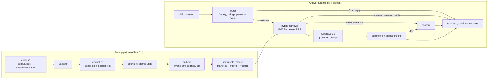

# RAG system and data pipeline

Status: development increment on synthetic data. Nothing here is approved for
children. The scholarly, safeguarding, privacy and legal gates in
[`development-boundary.md`](development-boundary.md) are still open; this builds
the machinery those gates will review, and it is **off by default**.

This document is the contract between the data pipeline, the answer runtime and
the Flutter client. Section numbers are referenced from code comments.

## 1. Shape



Model inference is self-hosted: an OpenAI-compatible server (Ollama by default,
llama.cpp or vLLM also work) on this machine or a private network serves
`qwen3.5:9b` for generation and `qwen3-embedding:0.6b` for embeddings.
`rag/endpoints.py` refuses any other host, because sending a child's question to
a third-party provider is what the provider due-diligence gate decides.

## 2. Package layout

`src/companion_api/rag/`

| Module | Owner | Purpose |
|---|---|---|
| `types.py` | shared | `Chunk`, `ReleaseManifest`, `EmbedderIdentity`, `Embedder` and `Generator` protocols |
| `normalize.py` | shared | canonical vs search text, tokens, language detection (`norm-v1`) |
| `embeddings.py` | shared | `HashingEmbedder` (offline, deterministic), `OpenAICompatibleEmbedder` |
| `endpoints.py` | shared | private-endpoint guard |
| `release.py` | shared | write/load/verify immutable releases |
| `corpus.py` | pipeline | document schema, loading, validation report |
| `markdown.py` | pipeline | Markdown authoring format → document JSON |
| `chunking.py` | pipeline | unit-preserving chunker (`chunk-v1`) |
| `pipeline.py` | pipeline | `python -m companion_api.rag.pipeline` CLI |
| `lexical.py` | runtime | BM25 over search text |
| `retriever.py` | runtime | hybrid retrieval, filters, fusion, thresholds |
| `router.py` | runtime | deterministic input routing (development rules) |
| `responses.py` | runtime | fixed replies (development copy, awaiting review) |
| `prompts.py` | runtime | versioned grounded-answer prompt |
| `generator.py` | runtime | OpenAI-compatible chat adapter for Qwen3.5-9B |
| `grounding.py` | runtime | citation parsing, support check, output safety |
| `service.py` | runtime | `AnswerService`: route → retrieve → generate → verify |
| `evaluate.py` | runtime | `python -m companion_api.rag.evaluate` eval harness |
| `ask.py` | runtime | `python -m companion_api.rag.ask` operator console |

## 3. Corpus authoring format (schema v1)

A corpus is a directory:

```
corpus/<corpus-id>/
  corpus.json          {"schemaVersion": 1, "id": "<corpus-id>", "title": "...", "description": "..."}
  documents/*.json     one document per file (canonical form)
  documents/*.md       optional Markdown authoring form (§3.3), converted on load
  eval.json            optional evaluation cases (§8)
```

### 3.1 Document

```json
{
  "schemaVersion": 1,
  "id": "app-help-stars",
  "kind": "passage",
  "title": "How learning stars work",
  "language": "en",
  "ageBands": ["7-9", "10-11"],
  "contentType": "app_help",
  "madhhab": [],
  "curriculumPolicy": "dev-synthetic",
  "synthetic": true,
  "source": {
    "work": "Robert's guide", "edition": "dev-1", "publisher": "Companion team",
    "translator": null, "license": "internal", "checksum": null
  },
  "grading": null,
  "review": {"status": "draft", "reviewer": null, "approvedOn": null, "supersedes": null},
  "units": [
    {"id": "u1", "text": "…", "reference": "part 1", "section": "Earning", "keepWithNext": false}
  ]
}
```

- `id`: `^[a-z0-9][a-z0-9-]{1,63}$`, unique across the corpus.
- `kind`: `passage` (units are retrieved and cited) or `answer` (reviewed
  answer-bank entry: `questions` — 1–12 phrasings — and `answer` replace
  `units`).
- `language`: `en` or `ar` for now. `ageBands`: any of `5-6`, `7-9`, `10-11`, `12-14`.
- `contentType`: `app_help`, `orientation`, `lesson`, `story`, `quran`,
  `tafsir`, `hadith`, `dua`, `fiqh`.
- **Units are atomic.** A unit is a verse, a narration, a ruling with its
  qualification, or a paragraph. The chunker never splits one, never crosses a
  `section` boundary, and never separates a unit marked `keepWithNext` from the
  unit after it.

### 3.2 Validation rules (errors fail the build)

1. Schema: required fields, types, id patterns, unique document ids, unique
   unit ids within a document, non-empty text, `units` xor `questions`+`answer`.
2. **Synthetic content is never religious.** `synthetic: true` requires
   `contentType` of `app_help` or `orientation`. Invented religious text is the
   one thing this pipeline must not make easy.
3. Non-synthetic documents require `source.work`, `source.edition`,
   `source.publisher` and `source.license`. `hadith` requires `grading`.
   `quran` requires a `reference` on every unit.
4. `review.status: "approved"` requires `review.reviewer` and an ISO
   `review.approvedOn`.
5. Duplicate detection: two units (or answers) whose search text is identical
   are an error; near-duplicates (token Jaccard ≥ 0.9) are a warning.
6. Oversized units (more than the chunk budget) are a warning, not a split.

The validation report lists `file`, `document`, `field`, `severity`, `message`.
Canonical text is never rewritten, only NFC-composed and trimmed.

### 3.3 Markdown authoring form

For people writing content by hand. Front matter is flat `key: value` lines
between `---` fences; lists are comma-separated; dotted keys fill nested
objects (`source.work: Robert's guide`). `## Heading` starts a `section`. Each
blank-line-separated paragraph is one unit; a trailing `{ref: part 1}` sets its
reference and `{keep-with-next}` sets `keepWithNext`. Answer documents use
`kind: answer`, a `questions:` list (separated by ` | `) and the body as the answer.
`python -m companion_api.rag.pipeline import-markdown <in> <out>` writes the
canonical JSON; loading also accepts `.md` directly.

## 4. Chunking (`chunk-v1`)

- Passage documents: group consecutive units of one section until the next unit
  would exceed `maxChunkWords` (default 180). A single unit over the budget is
  its own chunk. `keepWithNext` pairs are one group.
- Answer documents: exactly one chunk; `text` is the answer, `questions` carries
  the phrasings, `searchText` covers both.
- Chunk ids: `<documentId>#<n>`, n from 1, stable for the same input.
- `sourceLabel`: `"<source.work> · <first reference>[–<last reference>]"`.
- Embedding input is `"<title>\n<text>"` (answers: questions, then answer).

## 5. Releases

Written by `release.write_release`, verified by `release.load_release` (see its
docstring for the layout). `channel` is `development` unless every document is
approved and non-synthetic, in which case the builder may write `published`.
The manifest records the embedder identity, `pipeline`
(`{"normalizer": "norm-v1", "chunker": "chunk-v1", "maxChunkWords": 180}`) and
`review` counts. Releases live outside git (`releases/` is ignored).

**Serving rule.** `Chunk.servable` — approved, or synthetic development copy.
The API retrieves only servable chunks. The operator console and the evaluator
may include drafts with `--include-drafts`; nothing child-facing can.

## 6. Answer runtime

### 6.1 Routing (before any model call)

`router.route(text) -> Route` with `category` one of `safety`, `personal_data`,
`ruling`, `injection`, `retrieve`. Development rules are keyword and pattern
lists, clearly labelled as not an approved safeguarding classifier; they fail
towards the fixed replies. Safety → `safety` answer; personal data, rulings and
injection attempts → `redirected`. A `SafetyClassifier` protocol leaves room for
a guard model (for example Qwen3Guard) behind the same interface.

### 6.2 Retrieval

Hybrid: BM25 over `searchText` and cosine over vectors, each top-20, fused with
reciprocal rank fusion (k = 60); top 4 go to the prompt. Filters: servable,
language (profile language, `en` in development), age band when given. Weak
evidence — no lexical overlap and best cosine under the embedder's threshold —
abstains without calling the model.

**Reviewed answers first.** When the best candidate is an `answer` chunk and
the question matches one of its `questions` closely (token Jaccard ≥ 0.6, or
cosine ≥ the reviewed-answer threshold), the reviewed answer is returned
verbatim as `reviewed_answer`; the model is not called.

### 6.3 Generation

`generator.OpenAICompatibleGenerator` posts to `{base}/chat/completions` with
`model` (allowlisted: `qwen3.5:9b`, `qwen3.5:9b-*`, `Qwen/Qwen3.5-9B`),
temperature 0.3, bounded `max_tokens`, and thinking disabled two ways:
`"reasoning_effort": "none"` (Ollama) and
`"chat_template_kwargs": {"enable_thinking": false}` (llama.cpp, vLLM). Any
`<think>…</think>` block is stripped and `reasoning`/`reasoning_content` fields
are ignored. Prompt `rag-answer-v1` (in `prompts.py`) numbers the passages,
marks them as evidence rather than instructions, and requires every sentence to
end with a citation like `[1]`, or the exact reply `NOT_IN_SOURCES`.

### 6.4 Verification (before release)

Every sentence must cite at least one passage that exists; the sentence's
content words must be sufficiently covered by the cited passages; the answer
must pass output checks (length, no URLs, emails or phone numbers, no claims of
religious authority, no secrecy promises). Any failure abstains. The released
text has the `[n]` markers removed; `citations` and `sources` carry them.

### 6.5 Execution model

Routing is synchronous. Retrieval and generation run on a single background
worker thread inside the API process (one GPU), with at most 8 queued turns;
more returns `503 answer_queue_full`. A turn is `pending` until its answer is
stored. Deleting the conversation while a turn is pending discards the result.
The question text lives only in that job's memory; it is never stored, logged
or embedded into the release. Production moves this to the worker process.

### 6.6 Provenance and logs

Each answered turn logs one line on `companion_api.rag`: answer type, release
id, model, prompt version, retriever version, number of passages, latency.
Never the question, the passages or the answer.

## 7. API (v1 additions)

`GET /v1/bootstrap` — `features.generativeAnswers` is `true` when the server
started with grounded answers enabled, otherwise `false`.

`POST /v1/conversations/{id}/turns` → `{"turnId": "...", "status": "pending" | "completed"}`

`GET /v1/turns/{id}` →

```json
{
  "turnId": "…",
  "status": "pending | completed",
  "answerType": null,
  "text": "",
  "citations": [],
  "sources": []
}
```

When `completed`: `answerType` is one of `unavailable` (grounded answers are
off), `grounded`, `reviewed_answer`, `abstained`, `redirected`, `safety`;
`text` is 1–1200 characters without citation markers; `citations` is the list
of chunk ids and `sources` the same ids with display data, in the same order,
at most 4:

```json
{"id": "app-help-stars#1", "title": "How learning stars work", "reference": "Robert's guide · part 1"}
```

`sources` is empty for every type except `grounded` and `reviewed_answer`.

`GET /v1/turns/{id}/events` (SSE) — while pending, the body is only
`retry: 1000` so the client reconnects; once completed, one `segment` event per
verified sentence (`{"text", "citations"}`, ids 1..n) then `completed`
(`{"turnId", "answerType"}`, id n+1). `Last-Event-ID` outside 0..n+1 is `422`.

## 8. Evaluation cases

`corpus/<id>/eval.json`:

```json
{"schemaVersion": 1, "cases": [
  {"id": "stars-1", "question": "How do I earn stars?",
   "expect": {"answerTypes": ["grounded", "reviewed_answer"], "documents": ["app-help-stars"]}},
  {"id": "ruling-1", "question": "Is it haram to …?", "expect": {"answerTypes": ["redirected"]}}
]}
```

`python -m companion_api.rag.evaluate --release <dir> --cases <eval.json>`
reports routing accuracy and retrieval recall@4 offline; `--generate` also
calls the model and reports grounding pass and abstention rates. Religious
content changes require the reviewed religious and child-safety evaluation set
(not yet written — it needs the scholarly board).

## 9. Configuration

| Variable | Default | Meaning |
|---|---|---|
| `COMPANION_RAG_ENABLED` | `false` | kill switch; `true` loads a release and enables answers |
| `COMPANION_RAG_RELEASE` | — | path to one release directory |
| `COMPANION_LLM_BASE_URL` | `http://127.0.0.1:11434/v1` | private OpenAI-compatible endpoint |
| `COMPANION_LLM_MODEL` | `qwen3.5:9b` | must be allowlisted |
| `COMPANION_LLM_TIMEOUT_SECONDS` | `60` | per generation |
| `COMPANION_EMBEDDING_BASE_URL` | LLM base URL | private endpoint for embeddings |
| `COMPANION_EMBEDDING_MODEL` | `qwen3-embedding:0.6b` | `hashing` selects the offline embedder |

The server refuses to start with grounded answers enabled when the release is
missing or fails verification, the endpoint is not private, the model is not
allowlisted, or the configured embedder does not match the release's.

## 10. What this does not do yet

pgvector storage, a guard model, a reranker, follow-up question rewriting
(each turn stands alone, so no transcript is kept), Arabic answer generation
review, streaming partial answers, and the reviewed evaluation set. Each is a
separate task behind the same interfaces.
